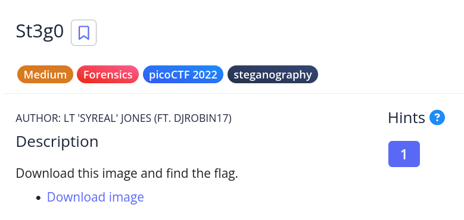

# [st3g0]

* **CTF Name:** picoCTF
* **Category:** Forensics, Steganography
* **Difficulty:** Medium
* **Hint:** We know the end sequence of the message will be $t3g0
* **Author:** Nakata Christian (n4ctbyte)
* **Date:** December 30, 2025
* **Source:** [Link to Challenge](https://play.picoctf.org/practice/challenge/305?category=4&page=3)

---

## Challenge Description



## 1. Executive Summary

**Objective:**
To recover hidden information embedded within a PNG image artifact (`pico.flag.png`) using advanced steganography analysis tools.

**Result:**
The investigation successfully recovered the flag `picoCTF{7h3r3_15_n0_5p00n_96ae0ac1}` which was hidden using LSB (Least Significant Bit) encoding.

**Method:**
Initial static analysis (`strings`, `exiftool`) yielded no results. The investigation proceeded with `zsteg` to analyze pixel data, which successfully revealed the hidden ASCII payload.

---

## 2. Evidence Identification

This section provides details regarding the initial evidence file.

- **Filename:** `pico.flag.png`
- **Size:** `14 KB`
- **MD5:** `045f95f60a03c1c89c6c3d0bf9baf8ab`

**Initial Check:**
Verifying file type using signature headers (Magic Bytes).

```bash
$ file pico.flag.png       
pico.flag.png: PNG image data, 585 x 172, 8-bit/color RGBA, non-interlaced
```

---

## 3. Investigation Steps

### Step 1: Xdg-Open

**Command:**
```bash
xdg-open pico.flag.png
```

**Observation:** The image is a picoCTF logo.

### Step 2: String Analysis

A static analysis was performed using `strings` to quickly identify potential flag artifacts.

**Command:**

```bash
strings pico.flag.png | grep "pico"
```

**Observation:** The lack of output indicates no human-readable 'pico' strings are present.

### Step 3: Exiftool Analysis

I examined the file metadata using `exiftool` to check for any comments or hidden tags containing the flag.

**Command:**

```bash
exiftool pico.flag.png | grep "pico"
```

**Observation:** The lack of output indicates no relevant metadata contains the string "pico".

### Step 4: LSB Analysis and Flag Discovery

Because of the problem category, I immediately thought of zsteg for steganography.

**Command:**

```bash
zsteg -a pico.flag.png | strings | grep 'pico'
```

**Explanation:** Running `zsteg` with `-a` checks all known LSB methods. Piping the output to `strings` cleans up binary noise, and grep filters specifically for the flag format.

**Observation:** The tool successfully detected the hidden text encoded in the LSB channels.

**Output:** `picoCTF{7h3r3_15_n0_5p00n_96ae0ac1}`

---

## 4. Conclusion

The challenge utilized LSB (Least Significant Bit) steganography to hide data within the image pixels. Conventional tools like `strings` or `binwalk` are ineffective against this technique as the data is not simply appended but encoded into the visual data itself. By using `zsteg`, which specializes in detecting hidden data in PNG bitmaps, I successfully extracted the flag.