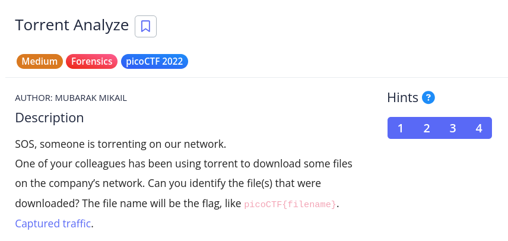

# [Torrent Analyze]

* **CTF Name:** picoCTF 2022
* **Category:** Forensics
* **Difficulty:** Medium
* **Hint:**
    * 1. Download and open the file with a packet analyzer like Wireshark.
    * 2. You may want to enable BitTorrent protocol (BT-DHT, etc.) on Wireshark. Analyze -> Enabled Protocols
    * 3. Try to understand peers, leechers and seeds. 
    * 4. The file name ends with .iso
* **Challenge Author:** MUBARAK MIKAIL
* **Writeup Author:** Nakata Christian (n4ctbyte)
* **Date:** January 24, 2026
* **Source:** [Link to Challenge](https://play.picoctf.org/practice/challenge/311?category=4&difficulty=2&page=2)

---

## Challenge Description



## 1. Executive Summary

**Objective:**
To analyze a network traffic capture (`.pcap`) to identify BitTorrent activity and recover the fullname of an `.iso` file being downloaded by the user.

**Result:**
The investigation successfully identified BT-DHT protocol packets containing file search requests (`Get_peers`). By extracting a unique **info_hash** and performing an external metadata lookup (OSINT), the file was identified as `ubuntu-19.10-desktop-amd64.iso`, revealing the flag: `picoCTF{ubuntu-19.10-desktop-amd64.iso}`.

**Method:**
The investigation employed network forensics (Wireshark) for deep packet inspection, binary protocol analysis (Bencode), and Open Source Intelligence (OSINT) to map hashes to file metadata.

---

## 2. Evidence Identification

This section provides details regarding the initial evidence file.

- **Filename:** `torrent.pcap`
- **Size:** `62 MB`
- **SHA-256:** `43be60629ba01766c6880b834d378edabe78a4874cd919efc69631cf32fa932e`

**Initial Check:**
Verifying file type using signature headers (Magic Bytes).

```bash
$ file torrent pcap                                                   
torrent.pcap: pcapng capture file - version 1.0
```

---

## 3. Investigation Steps

### Step 1: Protocol Filtering and Initial Obstacles

The analysis began by applying the standard `bittorrent` filter in Wireshark. However, this returned 0 packets, indicating that the torrent activity in this capture did not use standard TCP-based BitTorrent, but instead relied on UDP via the DHT (Distributed Hash Table) feature.

### Step 2: Deep Inspection on BT-DHT

I shifted to the `bt-dht` filter. This revealed numerous node-to-node information exchanges. I searched for `Get_peers` or `Announce_peers` messages, which typically carry the identity of the file being shared.

**Finding:** In packet No. 332, an `Announce_peers` message was found with the field `name: Zoo (2017) 720p...`. This was a video file, not the target `.iso`.

### Step 3: Finding the Target Info-Hash

Continuing the search for other `info_hash` values within the traffic.

**Finding:** In packet No. 51080, a `Get_peers` message from IP `192.168.73.132` was identified.

**Info-hash:** `e2467cbf021192c241367b892230dc1e05c0580e`

This packet did not include the filename in plaintext because DHT protocol messages only query for peers based on the file's unique fingerprint (hash).

### Step 4: OSINT Correlation (Hash-to-Name)

Since the filename was not present as a string within the `.pcap` (even after using the `strings` utility), I performed an external lookup of the discovered **Info-hash**.

Searching a public database (Google/LinuxTracker) for hash `e2467cbf021192c241367b892230dc1e05c0580e` consistently pointed to a specific Linux distribution release: `ubuntu-19.10-desktop-amd64.iso`.

---

## 4. Conclusion

This challenge demonstrates that in network forensics, applications often do not leave human-readable filenames. Success depends on the analyst's ability to extract unique binary identifiers (hashes) and correlate them with external intelligence (OSINT) to reconstruct the context of the activity.

Flag: `picoCTF{ubuntu-19.10-desktop-amd64.iso}`