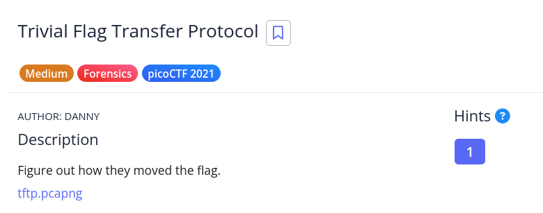

# [Trivial File TRansfer Protocol]

* **CTF Name:** picoCTF 2021
* **Category:** Forensics
* **Difficulty:** Medium
* **Hint:** What are some other ways to hide data?
* **Challenge Author:** DANNY
* **Writeup Author:** Nakata Christian (n4ctbyte)
* **Date:** January 13, 2026
* **Source:** [Link to Challenge](https://play.picoctf.org/practice/challenge/103?category=4&difficulty=2&page=4)

---

## Challenge Description



## 1. Executive Summary

**Objective:**
To analyze a network capture file (`.pcap`) involving the Trivial File Transfer Protocol (TFTP) and recover a hidden flag dispersed through encrypted instructions and steganographic images.

**Result:**
By extracting files from the TFTP traffic, I discovered encrypted instructions using ROT13 that provided a passphrase ("DUEDILIGENCE"). This passphrase was used to extract a hidden `flag.txt` from a BMP image via Steghide, resulting in the flag: `picoCTF{h1dd3n_1n_pLa1n_51GHT_18375919}`.

**Method:**
The investigation utilized Wireshark for object extraction, ROT13 decryption for command analysis, and Steghide for steganographic extraction.

---

## 2. Evidence Identification

This section provides details regarding the initial evidence file.

- **Filename:** `tftp.pcapng`
- **Size:** `50 MB`
- **SHA-256:** `2cf17f1a8837fb25613743df5c9b5d1a0748c783bfc02980689443adebd94156`

**Initial Check:**
Verifying file type using signature headers (Magic Bytes).

```bash
$ file tftp.pcapng 
tftp.pcapng: pcapng capture file - version 1.0
```

---

## 3. Investigation Steps

### Step 1: Network Object Extraction

The investigation began by analyzing the `.pcapng` file in Wireshark. Since the challenge name mentions TFTP, I utilized Wireshark’s export feature to retrieve all files transferred via the protocol.

**Action:** `File -> Export -> Objects -> TFTP...`

**Extracted Files:**
- `instructions.txt`
- `plan`
- `program.deb`
- `picture1.bmp`, `picture2.bmp`, `picture3.bmp`

### Step 2: Decrypting Instructions

The file `instructions.txt` contained a suspicious string of uppercase letters: `GSGCQBRFAGRAPELCGBHEGENSSVPFBJRZHFGQVFTHVFRBHESYNTGENAFSRE.SVTHERBHGNJNLGBUVQRGURSYNTNAQVJVYYPURPXONPXSBEGURCYNA`.

I used CyberChef with the ROT13 recipe to decode the instruction string, revealed the following plaintext:
`TFTPDOESNTENCRYPTOURTRAFFICSOWEMUSTDISGUISEOURFLAGTRANSFER.FIGUREOUTAWAYTOHIDETHEFLAGANDIWILLCHECKBACKFORTHEPLAN`

### Step 3: Analyzing the Plan

Following the hint in the instructions, I checked the `plan` file.

```bash
$ file plan         
plan: ASCII text
```

The content `VHFRQGURCEBTENZNAQUVQVGJVGU-QHRQVYVTRAPR.PURPXBHGGURCUBGBF`, when decrypted via ROT13, yielded:
`IUSEDTHEPROGRAMANDHIDITWITH-DUEDILIGENCE.CHECKOUTTHEPHOTOS`

This revealed two critical pieces of information:
1. **Passphrase:** `DUEDILIGENCE`
2. **Method:** Data is hidden within the extracted photos.

### Step 4: Steganographic Extraction

Based on the plan, I focused on the BMP images. Although `picture2.bmp` was the largest file, initial extraction attempts are typically performed across all available media files when the exact target is unspecified.

**Execution:** I systematically tested the passphrase `DUEDILIGENCE` against the images using Steghide. While `picture1.bmp` and `picture2.bmp` did not yield results, `picture3.bmp` successfully extracted the hidden payload.

**Command:**
```bash
$ steghide extract -sf picture3.bmp -p DUEDILIGENCE
wrote extracted data to "flag.txt".
```

**Final Flag Retrieval:**
```bash
$ cat flag.txt
picoCTF{h1dd3n_1n_pLa1n_51GHT_18375919}
```

---

## 4. Conclusion

This challenge demonstrates the risk of using unencrypted protocols like TFTP for sensitive data. It highlights how multiple layers of security such as simple substitution ciphers and steganography can be bypassed once the underlying logic and metadata are analyzed.