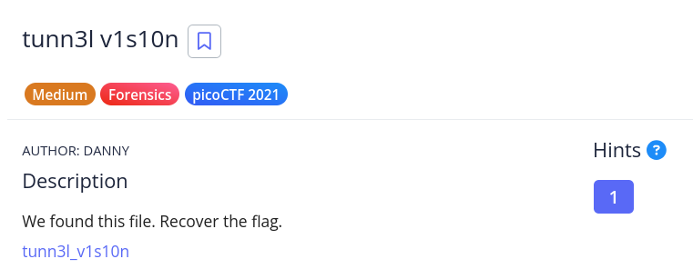
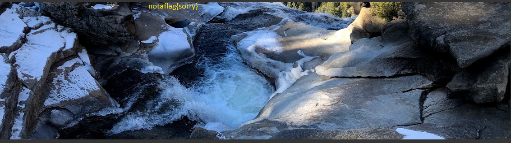

# [tunn3l v1s10n]

- **CTF Name:** picoCTF 2021
- **Category:** Forensics
- **Difficulty:** Medium
- **Hint:** None
- **Challenge Author:** DANNY
- **Writeup Author:** Nakata Christian (n4ctbyte)
- **Date:** January 14, 2026
- **Source:** [Link to Challenge](https://play.picoctf.org/practice/challenge/112?category=4&difficulty=2&page=3)

---

## Challenge Description



## 1. Executive Summary

**Objective:**
To analyze and repair a corrupted binary file that appears to be an image but cannot be opened by standard image viewers due to intentional header manipulation.

**Result:**
The investigation identified the file as a BMP (Bitmap) image with multiple corrupted header fields, specifically the DIB Header size and the Pixel Data Offset. After repairing these values and manually expanding the image's height via Hex manipulation, a hidden portion of the image was revealed, containing the flag: `picoCTF{qu1t3_a_v13w_2020}`.

**Method:**
The process involved File Signature Analysis, Hexadecimal Editing (Hex Editor), BMP Structure Verification, and Metadata Manipulation (Height modification).

---

## 2. Evidence Identification

This section provides details regarding the initial evidence file.

- **Filename:** `tunn3l_v1s10n`
- **Size:** `2.8 MB`
- **SHA-256:** `5bb235b7cf44f3f69d8f06d26d8da999d8aac29e87129b0561cc0c63f7e057bb`

**Initial Check:**
Verifying file type using signature headers (Magic Bytes).

```bash
$ file tunn3l_v1s10n
tunn3l_v1s10n: data
```

---

## 3. Investigation Steps

### Step 1: Repairing the Corrupt Headers

Analysis of the forst 14 bytes (BMP File Header) and the following 40 bytes (DIB Header) revealed two major anomalies:
1. **Pixel Data Offset (Offset 0A):**Set to `BA D0 00 00`. A standard BMP with a 40 byte DIB header usually starts data at `36 00 00 00` (54 bytes).

2. **DIB Header Size (Offset 0E):** Set to `BA D0 00 00`. The standard size for a `BITMAPINFOHEADER` is `28 00 00 00` (40 bytes).

**Action:**  I corrected these values using `hexeditor` to their standard counterparts.

### Step 2: Overcoming "Tunnel Vision"

After repairing the headers, the image could be opened but only displayed a fake flag (`notaflag{sorry}`) in a landscape view of a valley. This challenge title "tunn3l v1s10n" suggests that the current view is restricted.



In BMP files, pixels are stored from bottom to top. By increasing the image height value in the header, we can force the viewer to render additional pixel data that exist in the file but is hidden by the metadata.

**Original Height (Offset 16):** `32 01 00 00` (306 pixels).
**Modified Height:** `32 03 00 00` (818 pixels) to expand the canvas vertically.

### Step 3: Flag Retrieval

Upon reopening the modified flag using `xdg-open`, the image expanded upwards, revealing the actual flag hidden at the very top  of the original pixel data.


---

## 4. Conclusion

This challenge demonstrates how image viewers strictly rely on metadata headers to render files. By manipulating the height and header size, an attacker can effectively hide data within a seemingly normal image file. Manual binary analysis using Hex Editors remains a critical skill for uncovering data that automated tools might overlook.