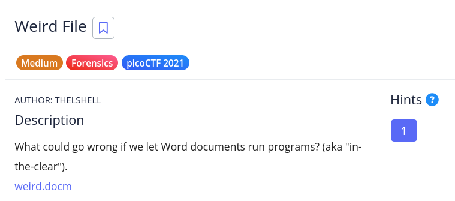

# [Weird File]

* **CTF Name:** picoCTF 2021
* **Category:** Forensics
* **Difficulty:** Medium
* **Hint:** https://www.youtube.com/watch?v=Y7IJjnLGqTQ
* **Challenge Author:** THELSHELL
* **Writeup Author:** Nakata Christian (n4ctbyte)
* **Date:** January 13, 2026
* **Source:** [Link to Challenge](https://play.picoctf.org/practice/challenge/101?category=4&difficulty=2&page=4)

---

## Challenge Description



## 1. Executive Summary

**Objective:**
To analyze a suspicious Microsoft Word document (`.docm`) and investigate potential malicious macros to uncover a hidden flag.

**Result:**
The investigation revealed that the document contained a VBA Macro designed to execute a Python command via the system shell. The flag was found encoded in Base64 within the Python script's arguments. Decoding the string yielded: `picoCTF{m4cr0s_r_d4ng3r0us}`.

**Method:**
The process involved File Signature Verification, OOXML Structure Deconstruction (unzipping), and VBA Macro Decompilation using olevba from the oletools suite.

---

## 2. Evidence Identification

This section provides details regarding the initial evidence file.

- **Filename:** `weird.docm`
- **Size:** `24 KB`
- **SHA-256:** `9b7135fe36916156976178390a289455b2a91e3e535834e9076e5e8d7fc9e650`

**Initial Check:**
Verifying file type using signature headers (Magic Bytes).

```bash
$ file weird.docm    
weird.docm: Microsoft Word 2007+
```

---

## 3. Investigation Steps

### Step 1: OOXML Structure Analysis

Since `.docm` files are essentially ZIP archives containing XML dan binary data, I used `binwalk` to inspect and extract the internal structure.

**Command:**
```bash
$ binwalk -e weird.docm
```

Extraction revealed a standard Office Open XML directory structure, with a notable presence of a VBA binary file located at `word/vbaProject.bin`. This file is the container for all macros within the document.

### Step 2: Macro Decompilation

To analyze the contents of `vbaProject.bin` without opening the document, I used `olevba`. This tool identifies suspicious keywords and extracts the source code.

**Command:**
```bash
$ olevba vbaProject.bin
```

**Key Output:** The tool identified an `AutoOpen` macro and a suspicious `Shell` command:

```vba
Sub AutoOpen()
    MsgBox "Macros can run any program", 0, "Title"
    Signature

End Sub
 
 Sub Signature()
    Selection.TypeText Text:="some text"
    Selection.TypeParagraph
    
 End Sub
 
 Sub runpython()

Dim Ret_Val
Args = """" '"""
Ret_Val = Shell("python -c 'print(\"cGljb0NURnttNGNyMHNfcl9kNG5nM3IwdXN9\")'" & " " & Args, vbNormalFocus)
If Ret_Val = 0 Then
   MsgBox "Couldn't run python script!", vbOKOnly
End If
End Sub

```

### Step 3: Payload Decoding

Before decoding the payload, it is crucial to understand what the VBA code actually performs:

1. **Trigger Mechanism:** The `Sub AutoOpen()` function ensures that the malicious logic executes automatically as soon as the user enables macros upon opening the document.

2. **Payload Execution:** The `runpython()` subroutine utilizes the `Shell` function to bridge the execution from the Word environment to the operating system's shell.

3. **Python One-Liner:** It calls `python -c`, which allows for the execution of Python code directly from the command line. The specific command `print(\"BASE64_STRING\")` is a common technique to deliver a second-stage payload or in this case, the encoded flag.

Identifying the encoded flag, I extracted the base64 string and decoded it via the terminal to retrieve the original plaintext:

```bash
$ echo "cGljb0NURnttNGNyMHNfcl9kNG5nM3IwdXN9" | base64 -d
picoCTF{m4cr0s_r_d4ng3r0us}
```

---

## 4. Conclusion

This challenge highlights the security risks associated with Office Macros. It demonstrates how attackers can use VBA to bridge into system-level execution (like Python). From a forensics perspective, it emphasizes the importance of analyzing the `vbaProject.bin` file in OOXML documents as a primary source of malicious logic.