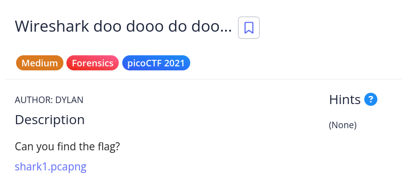

# [Wireshark doo dooo do doo...]

* **CTF Name:** picoCTF 2021
* **Category:** Forensics
* **Difficulty:** Medium
* **Hint:** None
* **Challenge Author:** DYLAN
* **Writeup Author:** Nakata Christian (n4ctbyte)
* **Date:** December 31, 2025
* **Source:** [Link to Challenge](https://play.picoctf.org/practice/challenge/115?category=4&difficulty=2&page=3)

---

## Challenge Description



## 1. Executive Summary

**Objective:**
To conduct a forensic analysis on a network capture file (`shark1.pcapng`) and recover a hidden flag within the traffic data.

**Result:**
The flag `picoCTF{p33kab00_1_s33_u_deadbeef}` was successfully recovered from **TCP Stream 5** after identifying and decoding a ROT13-obfuscated string.

**Method:**
Initial static analysis using `strings` failed to identify clear flag patterns. The investigation proceeded with Wireshark to inspect individual TCP conversations (streams). A suspicious ciphertext was located in Stream 5 and subsequently decrypted using a ROT13 cipher.

---

## 2. Evidence Identification

This section provides details regarding the initial evidence file.

- **Filename:** `shark1.pcapng`
- **Size:** `1.5 MB`
- **SHA-256:** `ec96487f920cc84596156cb4543524a4f263c95ebe40b82e3a9c6c7f34d6ba9f`

**Initial Check:**
Verifying file type using signature headers (Magic Bytes).

```bash
$ file shark1.pcapng
shark1.pcapng: pcapng capture file - version 1.0
```

---

## 3. Investigation Steps

### Step 1: Strings (Initial Triage)

**Command:**
```bash
strings shark1.pcapng | grep 'pico'
```

**Observation:** The command yielded no results. This indicated that the flag was likely obfuscated, encrypted, or split across packets, requiring a deeper inspection of the network packets.

### Step 2: Protocol and Stream Analysis

I opened the file in Wireshark to analyze the communication flow. My initial inspection of the default view showed mixed traffic. To understand the context, I decided to isolate specific conversations.

**Action:** Right-click on a TCP packet -> Follow -> TCP Stream.

**Observation:** The first stream (Stream 0) contained generic Kerberos/HTTP traffic which appeared irrelevant.

**Refining the Search:** Understanding that a network dump captures multiple concurrent conversations, I iterated through the TCP streams (changing the `Stream` index in the filter) to find relevant data.

**Discovery:** Upon reaching Stream 5, I found a text string that followed the flag format but appeared scrambled: `Gur synt vf cvpbPGS{c33xno00_1_f33_h_qrnqorrs}`

### Step 3: Decoding

I noticed the string `cvpbPGS` bears a strong structural resemblance to `picoCTF`. This specific shift is characteristic of the ROT13 algorithm.

**Action:** I used CyberChef to decode the ciphertext.
* Input: `Gur synt vf cvpbPGS{c33xno00_1_f33_h_qrnqorrs}`
* Operation: ROT13

**Output:**
```
The flag is picoCTF{p33kab00_1_s33_u_deadbeef}
```

---

## 4. Conclusion

The challenge demonstrated the importance of analyzing distinct network conversations (streams) rather than viewing packets in aggregate. The flag was hidden in a specific stream (Stream 5) and protected by a simple substitution cipher (ROT13), which bypassed initial plain-text searches. Navigating through TCP streams proved to be the decisive step in this investigation.