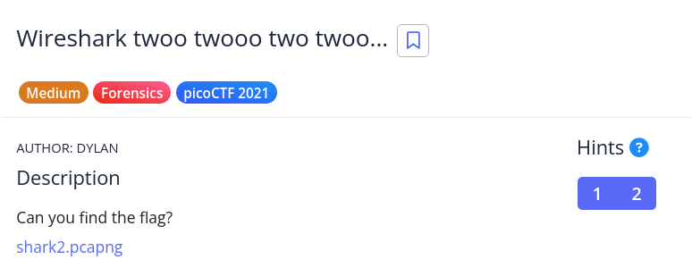

# [Wireshark twoo twooo two twoo...]

* **CTF Name:** picoCTF 2021
* **Category:** Forensics
* **Difficulty:** Medium
* **Hint:**
    * 1. Did you really find the flag?
    * 2. Look for traffic that seems suspicious.
* **Challenge Author:** DYLAN
* **Writeup Author:** Nakata Christian (n4ctbyte)
* **Date:** January 9, 2026
* **Source:** [Link to Challenge](https://play.picoctf.org/practice/challenge/110?category=4&difficulty=2&page=3)

---

## Challenge Description



## 1. Executive Summary

**Objective:**
To perform network traffic analysis on a provided packet capture file (`shark2.pcapng`) to identify data exfiltration and recover a hidden flag.

**Result:**
The flag was successfully recovered by identifying a DNS Exfiltration channel targeting a specific external IP (`18.217.1.57`). The data was hidden within Base64-encoded subdomains, bypassing the extensive "Red Herring" HTTP traffic found in the capture. The flag recovered is: `picoCTF{dns_3xf1l_ftw_deadbeef}`.

**Method:**
The investigation utilized Protocol Hierarchy Analysis (Wireshark) to identify anomalies in DNS traffic, followed by precise command-line extraction (TShark) on Kali Linux to reconstruct the fragmented payload.

---

## 2. Evidence Identification

This section provides details regarding the initial evidence file.

- **Filename:** `shark2.pcapng`
- **Size:** `3.4 MB`
- **SHA-256:** `3417bd27efb5f2cea2b662d625f426a585613deba4d1dbfad72134ac78639ea4`

**Initial Check:**
Verifying file type using signature headers (Magic Bytes).

```bash
$ file shark2.pcapng                  
shark2.pcapng: pcapng capture file - version 1.0
```

---

## 3. Investigation Steps

### Step 1: Initial Stream Analysis

I began with standard traffic analysis procedures to identify clear-text communication:

1. TCP & HTTP Streams: I applied `Follow TCP Stream` and `Follow HTTP Stream` on various packets. While there was significant HTTP traffic, switching between streams revealed only generic data or decoy text ("Red Herrings").

2. UDP Streams: I filtered for standard UDP traffic and attempted `Follow UDP Stream`, but found no suspicious payloads or meaningful conversations.

### Step 2: Anomaly Detection in DNS

Shifting focus to the DNS protocol, a After hitting dead ends with standard streams, I shifted focus specifically to the DNS protocol. While scrolling through the DNS queries, I visually noticed a distinct pattern: certain URLs contained long, random alphanumeric prefixes before the domain `reddshrimpandherring.com`.

**Observation:** These prefixes (e.g., `cGljb0NU...`) resembled Base64 encoded strings, suggesting a potential DNS tunneling or exfiltration attack.

### Step 3: Payload Extraction and Reconstruction

To isolate the flag, I filtered the traffic to target only DNS queries destined for the suspicious IP (`18.217.1.57`). Using `tshark`, I extracted the subdomain fields, deduplicated the retransmitted packets, and decoded the Base64 payload.

**Command:**
```bash
tshark -r shark2.pcapng -Y "ip.dst == 18.217.1.57 && dns" -T fields -e dns.qry.name | awk -F "." '{print $1}' | tr -d '\n' | base64 -d
```

**Data Sanitazion:**  The initial output from the command was "stuttering" or repeated due to packet retransmissions (e.g., `picoCTpicoCTpicoCTF{dns_F{dns_F{dns_3xf1l_3xf1l_3xf1l_ftw_deftw_deftw_deadbeefadbeefadbeef}}}}}}`).

**Reconstructed Flag:** picoCTF{dns_3xf1l_ftw_deadbeef}

---

## 4. Conclusion

This challenge demonstrates a classic DNS Tunneling/Exfiltration attack scenario. It highlights the importance of not relying solely on HTTP/TCP traffic analysis and the necessity of filtering out "noise" or decoy traffic (Red Herrings). The successful recovery relied on identifying the specific destination IP address that was receiving the true exfiltrated data chunks.