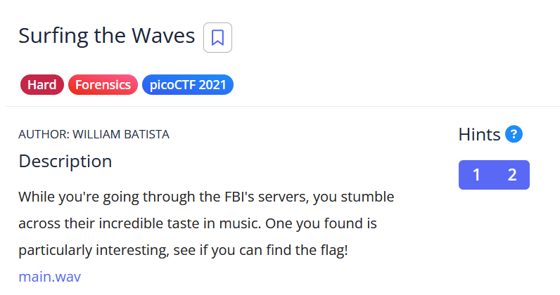

# [Surfing the Waves]

* **CTF Name:** picoCTF 2021
* **Category:** Forensics
* **Difficulty:** Hard
* **Hint:**
    * Music is cool, but what other kinds of waves are there?
    * Look deep below the surface
* **Challenge Author:** WILLIAM BATISTA
* **Writeup Author:** Nakata Christian (n4ctbyte)
* **Date:** February 10, 2026
* **Source:** [Link to Challenge](https://play.picoctf.org/practice/challenge/117?category=4&difficulty=3&page=1&search=)

---

## Challenge Description



## 1. Executive Summary

**Objective:**
To extract a hidden flag from a `.wav` audio file by decoding its amplitude values, which represent hexadecimal data encoded with a specific frequency interval.

**Result:**
By mapping the audio samples to hexadecimal characters using a custom mathematical formula, the original Python generator script was reconstructed. The flag `picoCTF{mU21C_1s_1337_5db6b85e}` was successfully recovered from the comments within the decoded source code.

**Method:**
The investigation utilized visual audio analysis (Audacity), data array extraction (`scipy.io.wavfile` & `numpy`), and custom Python scripting to reverse the mathematical operations applied to the audio amplitudes.

---

## 2. Evidence Identification

This section provides details regarding the initial evidence file.

- **Filename:** `main.wav`
- **Size:** `5.4 KB`
- **SHA-256:** `7a264fcc6c738c42544cda5cfa63aca0d8041af8b80f2d4236617549188cdc37`

**Initial Check:**
Verifying file type using signature headers (Magic Bytes).

```bash
$ file main.wav                          
main.wav: RIFF (little-endian) data, WAVE audio, Microsoft PCM, 16 bit, mono 2736 Hz
```

---

## 3. Investigation Steps

### Step 1: Raw Data Extraction

To analyze the exact amplitude values, the `.wav` file was read using Python's `scipy` library. I then used `numpy.unique()` to observe the distribution of the data points.

**Observation Script:**
```python
from scipy.io.wavfile import read
import numpy as np

rate, data = read("./main.wav")
print(np.unique(data))
```

**Observation:** The values were grouped in distinct clusters with an interval of ~500, starting from 1000 up to 8500 (e.g., `1000-1009`, `1500-1509`, `2000-2009`). The slight variations (the digits at the end) indicated intentional random noise added to each sample.

### Step 2: Formulating the Decoding Algorithm

There were exactly 16 distinct amplitude clusters, which perfectly maps to the 16 characters of the Hexadecimal system (0-15 or 0-F).

By establishing 1000 as the base value (Hex `0`) and 500 as the multiplier step, the following formula was derived to reverse the process and retrieve the original hex digit:

`Hex Digit = floor((Sample - 1000) / 500)`

### Step 3: Building the Decoder Script

A custom Python script was developed to iterate through the audio data, apply the formula, convert the integer to a hex character, and finally decode the concatenated hex string back into ASCII text.

**Exploit Script:**
```python
from scipy.io.wavfile import read

rate, data = read("./main.wav")
hex_results = []

for sample in data:
    digit_val = int((sample - 1000) / 500)
    
    if 0 <= digit_val <= 15:
        hex_char = format(digit_val, 'x')
        hex_results.append(hex_char)

full_hex = "".join(hex_results)
source_code = bytes.fromhex(full_hex).decode('utf-8')

print(source_code)
```

### Step 4: Flag Recovery

Executing the script successfully decoded the hex string into the original Python source code (`generate_wav.py`) that the challenge author used to create the audio file. The flag was found embedded within the comments of this script.

**Terminal Output (Snippet):**
```python
#!/usr/bin/env python3
import numpy as np
from scipy.io.wavfile import write
from binascii import hexlify
from random import random

... [code truncated] ...

# Your ears have been blessed
# picoCTF{mU21C_1s_1337_5db6b85e}
```

---

## 4. Conclusion

This challenge highlights that data representation is not strictly limited to standard text or binary files. Information can be physically represented through audio amplitude levels. Bypassing the intentional noise required viewing the audio file as a raw data array and utilizing custom scripting, rather than relying on automated steganography tools like `zsteg` or spectrogram analyzers.