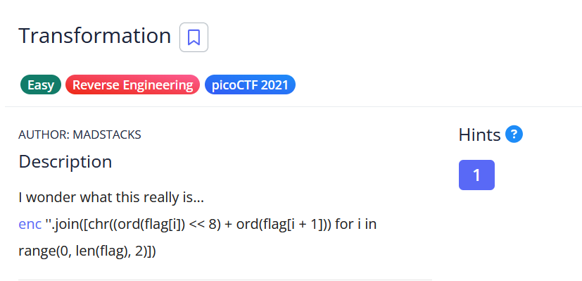

# [Transformation]

* **CTF Name:** picoCTF 2021
* **Category:** Reverse Engineering
* **Difficulty:** Easy
* **Hint:** You may find some decoders online
* **Challenge Author:** MADSTACKS
* **Writeup Author:** Nakata Christian (n4ctbyte)
* **Date:** February 16, 2026
* **Source:** [Link to Challenge](https://play.picoctf.org/practice/challenge/104?category=3&page=1)

---

## Challenge Description



## 1. Executive Summary

**Objective:**
To reverse a custom encoding algorithm that packs two 8-bit ASCII characters into a single 16-bit Unicode character.

**Result:**
By applying bitwise shifts and masking, I successfully de-obfuscated the Unicode string back into its original ASCII components, recovering the flag: `picoCTF{16_bits_inst34d_of_8_b7f62ca5}`.

**Method:**
The investigation involved mathematical reversal of the provided Python one-liner using a custom decoder script.

---

## 2. Evidence Identification

This section provides details regarding the initial evidence file.

- **Filename:** `enc`
- **Size:** `3.4 KB`
- **SHA-256:** `7c1bf8575ec74d79e22ad8b907cca63b8eb054ba14cda0d3872bc593cc1421c5`

**Initial Check:**
Verifying file type using signature headers (Magic Bytes).

```bash
$ file enc            
enc: Unicode text, UTF-8 text, with no line terminators
```

---

## 3. Investigation Steps

### Step 1: Analyzing the Encoding Algorithm

The provided Python snippet performs the following operations for every pair of characters in the flag:
1. `ord(flag[i]) << 8`: Takes the first character's ASCII value and shifts it 8 bits to the left (effectively moving it to the "High Byte" position).
2. `+ ord(flag[i + 1])`: Adds the second character's ASCII value to the "Low Byte" position.
3. `chr(...)`: Converts the resulting 16-bit integer into a single Unicode character.

**Mathematical Model:**
$$\text{Combined} = (\text{Byte}_{\text{high}} \times 256) + \text{Byte}_{\text{low}}$$

### Step 2: Designing the Decoder Logic

To reverse this, we need to extract the two original bytes from the 16-bit value:
1. **To get the High Byte:** Shift the combined value 8 bits to the right (`>> 8`).
2. **To get the Low Byte:** Apply a bitwise AND mask with `0xff` (`& 255`) to isolate the last 8 bits.

### Step 3: Implementation (Solver Script)

I wrote a Python script to automate the reversal across the entire encoded string:

```python
with open('enc', 'r') as f:
    encoded = f.read()

flag = ""
for char in encoded:
    val = ord(char)
    # Extract the two original characters
    flag += chr(val >> 8)   # High byte
    flag += chr(val & 0xff) # Low byte

print(f"Decoded Flag: {flag}")
```

### Step 4: Execution and Flag Recovery

Running the script against the `enc` file successfully reconstructed the flag.

**Terminal Output:**
```bash
$ python3 solver.py
Decoded Flag: picoCTF{16_bits_inst34d_of_8_b7f62ca5}
```

---

## 4. Conclusion

This challenge demonstrates the concept of Data Packing and the importance of understanding bitwise operations. While the resulting characters appeared to be random Unicode symbols, they were merely a different representation of the original 8-bit ASCII data.