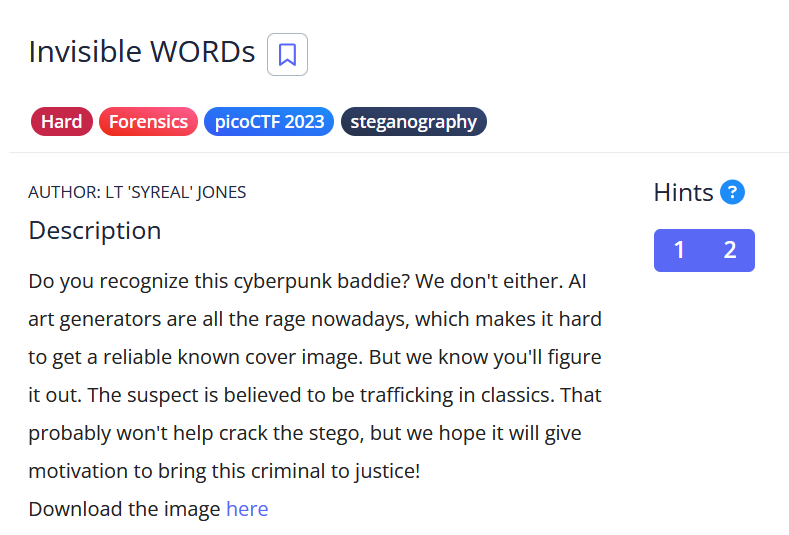

# [Invisible WORDs]

* **CTF Name:** picoCTF 2023
* **Category:** Forensics, steganography
* **Difficulty:** Hard
* **Hint:**
    * Something doesn't quite add up with this image...
    * How's the image quality?
* **Challenge Author:** LT 'SYREAL' JONES
* **Writeup Author:** Nakata Christian (n4ctbyte)
* **Date:** February 7,2026
* **Source:** [Link to Challenge](https://play.picoctf.org/practice/challenge/354?category=4&difficulty=3&page=1&search=)

---

## Challenge Description



## 1. Executive Summary

**Objective:**
To extract a hidden flag from a BMP image file that employs a non-standard interleaving steganography technique.

**Result:**
By identifying a fragmented ZIP header and applying a custom data de-interleaving script, I successfully reconstructed a hidden ZIP archive. The archive contained a file named `ZnJhbmtlbnN0ZWluLXRlc3QudHh0` (Base64 decoded: `frankenstein-test.txt`), which held the flag: `picoCTF{w0rd_d4wg_y0u_f0und_5h3113ys_m4573rp13c3_b48ea7de}`.

**Method:**
The investigation utilized hex analysis, manual signature identification, and custom Python scripting.

---

## 2. Evidence Identification

This section provides details regarding the initial evidence file.

- **Filename:** `output.bmp`
- **Size:** `2 MB`
- **SHA-256:** `fc52c06789091f0c1529ff9155447d1067bee0b0462ab1dde3fe7b66e5ba73a8`

**Initial Check:**
Verifying file type using signature headers (Magic Bytes).

```bash
$ file output.bmp                                 
output.bmp: PC bitmap, Windows 98/2000 and newer format, 960 x 540 x 32, cbSize 2073738, bits offset 138
```

---

## 3. Investigation Steps

### Step 1: Initial Enumeration and Tool Limitations

I began the investigation with standard forensic procedures. First, I used `binwalk` to check for any embedded files, but it returned no significant results, likely due to the non-standard way the data was interleaved.

**Command:**
```bash
$ binwalk output.bmp
# No results found (Signature-based detection failed)
```

Next, I analyzed the image using `StegSolve` to check for LSB (Least Significant Bit) steganography across various bit planes (Red 0. Blue 0, Green 0, etc.). While some noise was visible, no clear data or strings were extractable. This led me to suspect that the data wasn't hidden in the pixel bits, but rather embedded directly within the file's binary structure using a custom pattern.

### Step 2: Manual Hex Analysis

Failing with automated tools, I moved to a Hex Editor to perform a manual "sanity check" on the file's raw bytes. Upon inspecting the early offsets, I noticed a familiar signature starting at offset `0x8C`. I identified the bytes `50 4B`, which correspond to the PK ZIP file header. However, the signature was not contiguous. Instead of the standard `50 4B 03 04`, the bytes were separated: `50 4B D7 BA 03 03...`.

### Step 3: Developing the Extraction Script

Standard carving tools like `binwalk` failed because the noise bytes corrupted the ZIP structure. I wrote a custom Python script to filter out the noise by reading 2 bytes and skipping the next 2 bytes, starting from PK signature at offset `140` (`0x8C`).

**Python Script:**
```python
with open('output.bmp', 'rb') as ip, open('recovered.zip', 'wb') as op:
    data = ip.read()
    for idx in range(140, len(data), 4):
        op.write(data[idx:idx+2])
```

### Step 4: Archive Repair and Extraction

After running the script, the file `recovered.zip` was identified as a ZIP archive. However, the `unzip` utility reported an error: `End-of-central-directory signature not found`. This indicated that the archive's trailer was corrupted or missing due to the interleaving process.

I attempted to repair it using `zip -F`, but it failed. I then used the `jar` utility (from Java Development Kit), which is known to be more robust and tolerant of corrupted ZIP structures.

**Command:**
```bash
$ jar xf recovered.zip

$ file ZnJhbmtlbnN0ZWluLXRlc3QudHh0
ZnJhbmtlbnN0ZWluLXRlc3QudHh0: Unicode text, UTF-8 (with BOM) text, with CRLF, LF line terminators
```

### Step 5: Flag Recovery

The extraction produced a file with a Base64 encoded name: `ZnJhbmtlbnN0ZWluLXRlc3QudHh0`. Base64 decoded: `frankenstein-test.txt` (reference to Mary Shelley's classic novel, Frankenstein, which explains the "trafficking in classics" hint).

**Verifying the File and Retrieve the Flag:**
```bash
$ file ZnJhbmtlbnN0ZWluLXRlc3QudHh0
ZnJhbmtlbnN0ZWluLXRlc3QudHh0: Unicode text, UTF-8 (with BOM) text, with CRLF, LF line terminators

$ cat ZnJhbmtlbnN0ZWluLXRlc3QudHh0 | grep 'pico'
At that age I became acquainted with the celebrated picoCTF{w0rd_d4wg_y0u_f0und_5h3113ys_m4573rp13c3_b48ea7de}
```

---

## 4. Conclusion

The "Invisible WORDs" challenge demonstrates that automated forensic tools are not always sufficient. Success required a deep dive into the binary structure and the creation of a surgical extraction primitive based on architectural concepts (Words). The reference to Mary Shelley's Frankenstein in the flag tied back perfectly to the "Classics" and "AI-generated" theme of the challenge.