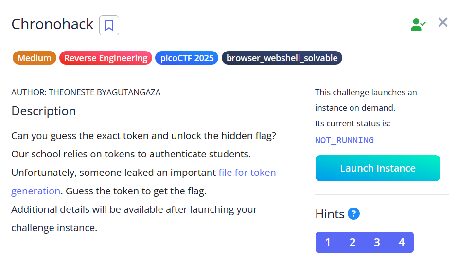

# [Chronohack]

* **CTF Name:** picoCTF 2025
* **Category:** Reverse Engineering
* **Difficulty:** Medium
* **Hint:**
    1. https:///www.epochconverter.com/
    2. https://learn.snyk.io/lesson/insecure-randomness/
    3. Time tokens generation
    4. Generate tokens for a range of seed values very close to the target time
* **Challenge Author:** BYAGUTANGAZA
* **Writeup Author:** Nakata Christian (n4ctbyte)
* **Date:** February 21, 2026
* **Source:** [Link to Challenge](https://play.picoctf.org/practice/challenge/468?category=3&difficulty=2&page=1)

---

## Challenge Description



## 1. Executive Summary

**Objective:**
To bypass a token-bsed authentication system by predicting the output of a Pseudo-Random Number Generator (PRNG) that uses an insecure, time-based seed.

**Result:**
By synchronizing local system time with the server and performing a brute-force attack on the millisecond-precision seed, I reconstructed the identical token and successfully retrieved the flag: `picoCTF{UseSecure#$_Random@j3n3r@T0rsbcd2557d}`.

**Method:**
The methodology involved identifying a Weak PRNG Seeding vulnerability in the Python `random` module, followed by an automated synchronization attack using `pwntools` to account for network latency and clock drift.

---

## 2. Evidence Identification

This section provides details regarding the initial evidence file.

- **Filename:** `token_generator.py`
- **Size:** `1.3 KB`
- **SHA-256:** `0ca1ac767308b2a7f95f4c1312953d3473cfc7bd1a2b2f26f5a189edd1feac89`

**Initial Check:**
Verifying file type using signature headers (Magic Bytes).

```bash
$ file token_generator.py        
token_generator.py: Python script, ASCII text executable
```

---

## 3. Investigation Steps

### Step 1: Identifying the Deterministic PRNG Vulnerability

The Python `random` module uses the Mersenne Twister algorithm, which is deterministic. If the seed is known, every subsequent "random" choice is predictable. In this challenge, the seed is derived from:

**Mathematical Model:**
$$\text{Seed} = (\text{Time}_{\text{epoch}} \times 1000)$$

Since $\text{Time}_{\text{epoch}}$ (Unix timestamp) is public information, the only unknown variable is the exact millisecond of execution on the server.

### Step 2: Analyzing the Brute-Force Feasibility

The server allows up to 50 attempts per connection. Due to network latency (RTT) and potential clock desynchronization between the local machine and the remote server, the server's execution time will differ from the local time by an offset.

### Step 3: Implementing the Automated Exploit

I developed a Python script using `pwntools` to parallelize the search. The script opens a connection, captures the current local timestamp, and systematically probes both "past" and "future" millisecond offsets to account for latencies.

**Solver Script:**
```python
from pwn import *
import random
import time

# Set log_level to 'error' to keep the terminal output clean
context.log_level = 'error'

def attack():
    host = 'verbal-sleep.picoctf.net'
    port = 54421 # Ensure the port matches the active instance

    alphabet = "0123456789ABCDEFGHIJKLMNOPQRSTUVWXYZabcdefghijklmnopqrstuvwxyz"
    token_length = 20

    print("[*] Starting token synchronization attack...")
    print("[*] Monitoring network latency and clock drift...")

    # Scanning from -5000ms to +5000ms with a step of 40ms to ensure overlap
    # This covers a 10-second window around the local execution time
    for offset in range(-5000, 5000, 40):
        try:
            r = remote(host, port)
            # Capture base timestamp after connection established
            now = int(time.time() * 1000)
            
            # Probing 50 seeds per connection (Server-side attempt limit)
            for i in range(50):
                test_seed = now + (offset + i)
                random.seed(test_seed)
                
                # Reconstruct the token locally
                candidate_token = "".join(random.choice(alphabet) for _ in range(token_length))
                
                # Submit the guess to the server
                r.sendlineafter(b"token (or exit):", candidate_token.encode(), timeout=2)
                
                response = r.recvline()
                
                if b"Congratulations" in response:
                    print(f"\n[+] SYNCHRONIZATION SUCCESSFUL!")
                    print(f"[+] Found Seed: {test_seed}")
                    print(f"[+] Offset: {offset + i}ms from local time")
                    print(f"[+] Flag: {r.recvall().decode().strip()}")
                    r.close()
                    return
            
            r.close()
            print(f"[-] Probing offset: {offset}ms... (No match)", end='\r')
            
        except EOFError:
            continue
        except Exception as e:
            print(f"\n[!] Connection Error: {e}")
            break

if __name__ == "__main__":
    attack()
```

### Step 4: Synchronization and Flag Recovery

Upon executing the script, the brute-force engine began scanning the temporal window. The script effectively bridged the gap between the local system time in Riau and the remote server's clock.

Success was achieved when the local PRNG state matched the server's state at an offset of -960ms. This indicates that the server had initialized its seed approximately one second prior to the local script's reference point, likely due to a combination of network handshake duration and minor clock desynchronization.

**Terminal Output:**
```plaintext
[*] Starting token synchronization attack...
[*] Monitoring network latency and clock drift...
[-] Probing offset: -1000ms... (No match)
[+] SYNCHRONIZATION SUCCESSFUL!
[+] Found Seed: 1771355529086
[+] Offset: -960ms from local time
[+] Flag: picoCTF{UseSecure#$_Random@j3n3r@T0rsbcd2557d}
```

The server accepted the reconstructed token, triggering the `flag()` function and revealing the flag.

---

## 4. Conclusion

The Chronohack challenge serves as a textbook example of why system time is an insufficient source of entropy for security-critical operations. The vulnerability stems from two main factors:
1. **Predictability:** $\text{Time}_{\text{epoch}}$ is a publicly observable value.
2. **Determinism:** The Mersenne Twister algorithm (Python's `random` default) produces the exact same sequences for any given seed.