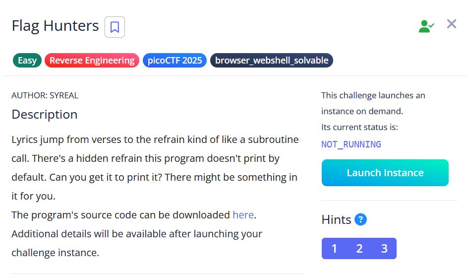

# [Flag Hunters]

* **CTF Name:** picoCTF 2025
* **Category:** Reverse Engineering
* **Difficulty:** Easy
* **Hint:**
    * This program can easily get into undefined states. Don't be shy about Ctrl+C.
    * Unsanitized user input is always good, right?
    * Is there any syntax that is ripe for subversion?
* **Challenge Author:** SYREAL
* **Writeup Author:** Nakata Christian (n4ctbyte)
* **Date:** February 16, 2026
* **Source:** [Link to Challenge](https://play.picoctf.org/practice/challenge/472?category=3&page=1)

---

## Challenge Description



## 1. Executive Summary

**Objective:**
To manipulate the execution flow of a Python-based lyric reader to access a hidden variable (`secret_intro`) containing the flag, which is skipped by the program's default entry point.

**Result:**
By exploiting a lack of input sanitization in the `CROWD` input prompt and leveraging the program's use of the semicolon (`;`) as a command delimiter, I successfully injected a `RETURN 0` instruction. This reset the Instruction Pointer (`lip`) to the start of the lyric array, revealing the flag: `picoCTF{70637h3r_f0r3v3r_b248b032}`.

**Method:**
The investigation involved static code analysis of the Python source, specifically targeting the lyric parsing logic and the instruction pointer (`lip`) management.

---

## 2. Evidence Identification

This section provides details regarding the initial evidence file.

- **Filename:** `lyric-reader.py`
- **Size:** `3.4 KB`
- **SHA-256:** `08e2920c7a8ae2cf30e76a8ff0fb829f34af6dbc09f0f397c8d31c31784bb0e8`

**Initial Check:**
Verifying file type using signature headers (Magic Bytes).

```bash
$ file lyric-reader.py
lyric-reader.py: Python script, Unicode text, UTF-8 text executable
```

---

## 3. Investigation Steps

### Step 1: Analyzing the Parser Logic

The `reader` function processes the song line by line using a variable `lip` (Lyric Instruction Pointer). Crucially, it splits each line by a semicolon:
```python
for line in song_lines[lip].split(';'):
    if line == 'REFRAIN':
        # Logic to jump to refrain
    elif re.match(r"RETURN [0-9]+", line):
        lip = int(line.split()[1]) # Direct manipulation of Instruction Pointer
```

### Step 2: Identifying the Injection Vector

The program allows user interaction through `CROWD` tag. It takes an input and writes it directly back into the `song_lines` array:
```python
elif re.match(r"CROWD.*", line):
    crowd = input('Crowd: ')
    song_lines[lip] = 'Crowd: ' + crowd
    lip += 1
```
Because the program uses `.split(';')` to process lines, an input containing a semicolon can inject a new "instruction" into the parser's loop.

### Step 3: Crafting the Payload

The goal is to set `lip` to `0`. Since the parser checks for the `RETURN [index]` pattern, I can inject this command via the `Crowd` prompt.

**Payload:** `;RETURN 0`

When the parser reaches the injected line, it splits it into:
1. `Crowd:` (Printed as text)
2. `RETURN 0` (Matched by the regex, setting `lip = 0`)

### Step 4: Remote Execution

Connecting to the challenge instance via `nc` and waiting for the `Crowd` prompt:
```bash
$ nc verbal-sleep.picoctf.net 64370
...
[VERSE1]
...
Crowd: ;RETURN 0
```

### Step 5: Flag Recovery

Immediately after the injection, the program loops back to the start of the `song_lines` array, executing the `secret_intro` block.

**Terminal Output:**
```plaintext
Pico warriors rising, puzzles laid bare,
Solving each challenge with precision and flair.
With unity and skill, flags we deliver,
The ether’s ours to conquer, picoCTF{70637h3r_f0r3v3r_b248b032}
```

---

## 4. Conclusion

The vulnerability stems from trusting user input. By allowing the user to insert characters used for control logic (the semicolon `;`), the program allowed an attacker to break out of the intended "data" context and enter the "control" context. This allowed for arbitrary redirection of the program's execution flow.