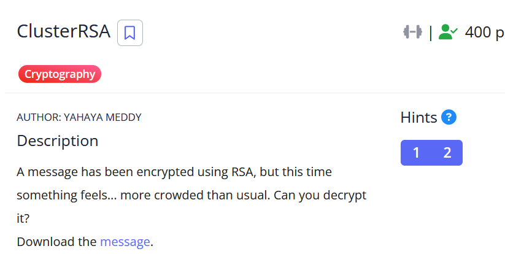

# [ClusterRSA]

* **CTF Name:** picoCTF 2026
* **Category:** Cryptography
* **Difficulty:** 400 points
* **Hint:** 
    * RSA usually means two primes... but what if someone got greedy?
    * Prime factors decomposition
* **Challenge Author:** YAHAYA MEDDY
* **Writeup Author:** Nakata Christian (n4ctbyte)
* **Date:** March 15, 2026
* **Source:** [Link to Challenge](https://play.picoctf.org/events/79/challenges/702?category=2&page=1)

---

## Challenge Description



## 1. Executive Summary

**Objective:**
To decrypt a message encrypted using a non-standard RSA implementation where the modulus n is composed of more than two prime factors.

**Result:**
The investigation identified that the modulus n was a 332-bit number composed of four distinct prime factors. By utilizing FactorDB for rapid factorization, I calculated the generalized Euler's Totient function, recovered the private key d, and decrypted the flag. Flag: `picoCTF{mul71_rsa_e89f8efb}`.

**Method:**
The methodology involved prime factorization via an online database (FactorDB) to save computational time, followed by a Python script to perform Multi-prime RSA decryption.
---

## 2. Evidence Identification

This section provides details regarding the initial evidence file.

- **Filename:** `message.txt`
- **Size:** `221 Bytes`
- **SHA-256:** `050dc27aaed85223a026db25f3cc55afd053ce2c44a83ac6fd2eb680888a3dce`

**Initial Check:**
Verifying file type using signature headers (Magic Bytes).

```bash
$ file message.txt
message.txt: ASCII text
```

---

## 3. Investigation Steps

### Step 1: Identifying the Vulnerability

The hint "someone got greedy" suggested that the modulus n contains more than the standard two primes (p and q). Additionally, the modulus is only 332 bits long, which is extremely weak by modern standards and susceptible to public factorization databases.

### Step 2: Factorization

Instead of performing local factorization using Pollard's Rho or ECM, which could be time-consuming for a 100-digit number, I queried FactorDB. The modulus was found to be composed of four distinct primes:

* p1​ = 9671406556917033397931773
* p2 ​= 9671406556917033398314601
* p3​ = 9671406556917033398439721
* p4​ = 9671406556917033398454847

### Step 3: Calculating the Private Key

For Multi-prime RSA, the Euler's Totient function is generalized as:
$$\phi(n) = (p_1 - 1)(p_2 - 1)(p_3 - 1)(p_4 - 1)$$

Using this value, the private exponent d is calculated as the modular multiplicative inverse of e modulo $\phi(n)$:
$$d \equiv e^{-1} \pmod{\phi(n)}$$

### Step 4: Automating Decryption

I implemented the following Python script to automate the retrieval of factors and the final decryption.

**Solver Script:**
```python
from factordb.factordb import FactorDB
from Crypto.Util.number import inverse, long_to_bytes

# Parameters
n = 8749002899132047699790752490331099938058737706735201354674975134719667510377522805717156720453193651
e = 65537
ct = 2750436858778878533730006003450169749121218602752224680062251290197546037822491178192939762187934008

# Query Oracle
fdb = FactorDB(n)
fdb.connect()
factors = fdb.get_factor_list()

# Multi-prime RSA decryption
phi = 1
for p in factors:
    phi *= (p - 1)

d = inverse(e, phi)
m = pow(ct, d, n)

print(f"Factors: {factors}")
print(f"Flag: {long_to_bytes(m).decode()}")
```

**Terminal Output:**
```bash
$ python3 a.py                                      
Factors: [9671406556917033397931773, 9671406556917033398314601, 9671406556917033398439721, 9671406556917033398454847]
Flag: picoCTF{mul71_rsa_e89f8efb}
```
---

## 4. Conclusion

This challenge demonstrates that the security of RSA rests entirely on the difficulty of the Integer Factorization Problem (IFP).

1. **Insufficient Modulus Size:** A 332-bit modulus provides negligible security. Regardless of the number of prime factors used, any modulus of this size can be factored almost instantaneously with optimized algorithms.

2. **Multi-prime Implementation:** While Multi-prime RSA can offer faster decryption in legitimate systems, it does not compensate for a short bit-length. The strength of the system is only as good as the time required to recover its factors.