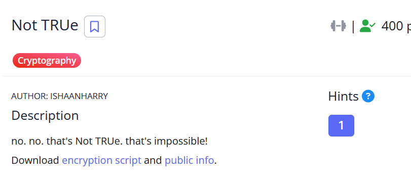

# [Not TRUe]

* **CTF Name:** picoCTF 2026
* **Category:** Cryptography
* **Difficulty:** 400 points
* **Hint:** This is a lattice based cryptosystem. Is there a lattice attack that allows you to compute the private key given the public information?
* **Challenge Author:** ISHAANHARRY
* **Writeup Author:** Nakata Christian (n4ctbyte)
* **Date:** March 14, 2026
* **Source:** [Link to Challenge](https://play.picoctf.org/events/79/challenges/711?category=2&page=1)

---

## Challenge Description



## 1. Executive Summary

**Objective:**
To recover the private key of an NTRU (N-th degree Truncated polynomial Ring Units) cryptosystem and decrypt the flag, given a small polynomial degree N and the public key h.

**Result:**
The investigation identified that the parameter N=48 was insecurely small. By constructing a 2Nx2N lattice matrix and applying the LLL algorithm, the private key f was successfully recovered. Using f, the ciphertext was decrypted to reveal the flag.
Flag: `picoCTF{th4ts_s0_N0t_TRU3_f33ab308}`.

**Method:**
The methodology involved identifying the cryptosystem as NTRU, constructing a Lattice matrix based on the public key h and modulus q, and performing Lattice Reduction to find the short vector representing the private key.
---

## 2. Evidence Identification

This section provides details regarding the initial evidence file.

- **Filename:** `encrypt.py`
- **Size:** `1.7 KB`
- **SHA-256:** `e4594ce22027e4ec451dab78e21549072c07b5595262c431ad59b84dd751fc0a`

- **Filename:** `public.txt`
- **Size:** `1.7 KB`
- **SHA-256:** `ee84c1c32d83d22bb89f854706f02314af9bf18e38690768882cd84edbd41379`

**Initial Check:**
Verifying file type using signature headers (Magic Bytes).

```bash
$ file encrypt.py   
encrypt.py: Python script, ASCII text executable
                                                                        $ file public.txt    
public.txt: ASCII text, with very long lines (1398)
```

---

## 3. Investigation Steps

### Step 1: Analyzing the Cryptosystem

The source code reveals a standard NTRU implementation:
1. Two small ternary polynomials f and g are generated.
2. The public key h is computed as $$h \equiv p \cdot f^{-1} \cdot g \pmod{q}$$.
3. Encryption: $$c \equiv p \cdot r \cdot h + m \pmod{q}$$.

The critical vulnerability is the value of N=48. Modern secure NTRU implementations require N>500. With N=48, the private key can be recovered using Lattice Reduction.

### Step 2: The Lattice Attack Logic

In NTRU, the relationship $$f \cdot h \equiv p \cdot g \pmod{q}$$ can be written as $$f \cdot h - k \cdot q = p \cdot g$$. This means the vector (`f`, `p*g`) is a short vector in a lattice L generated by the columns of the following matrix:
$$
M = \begin{pmatrix} 
I_{N \times N} & H \\ 
0_{N \times N} & qI_{N \times N} 
\end{pmatrix}
$$

Since the coefficients of f and g are very small (-1, 0, 1), the LLL algorithm will find this short vector easily.

### Step 3: Implementing the LLL Attack

I developed a SageMath script to construct the lattice, reduce it using LLL, and attemp decryption with the recovered private key candidates.

**Solver Script:**
```python
from sage.all import *

N = 48
p = 3
q = 509
h_list = [47, 353, 312, 148, 133, 49, 85, 366, 118, 327, 39, 478, 238, 395, 102, 92, 123, 455, 346, 185, 471, 140, 184, 124, 476, 333, 199, 318, 508, 405, 361, 156, 121, 86, 431, 150, 7, 35, 270, 393, 433, 244, 297, 31, 190, 424, 367, 168]
ct = [[245, 115, 398, 371, 40, 476, 387, 446, 379, 503, 136, 361, 349, 404, 20, 484, 454, 10, 299, 37, 73, 425, 361, 427, 426, 354, 140, 53, 416, 421, 303, 339, 187, 362, 112, 286, 326, 493, 291, 176, 213, 185, 185, 407, 292, 140, 362, 115], [275, 42, 358, 113, 66, 228, 403, 215, 349, 130, 181, 110, 413, 73, 386, 322, 62, 341, 323, 241, 331, 400, 1, 212, 277, 313, 204, 430, 174, 461, 403, 96, 313, 371, 247, 339, 44, 410, 244, 495, 487, 478, 382, 151, 158, 102, 90, 103], [197, 484, 500, 11, 138, 93, 492, 160, 10, 336, 10, 17, 143, 94, 257, 468, 108, 7, 118, 393, 355, 264, 122, 13, 323, 469, 360, 473, 283, 423, 200, 16, 433, 234, 248, 163, 13, 319, 173, 420, 368, 69, 221, 421, 387, 78, 437, 432], [376, 0, 326, 342, 93, 189, 21, 311, 167, 275, 34, 155, 369, 476, 182, 7, 202, 175, 497, 324, 67, 210, 251, 455, 17, 387, 456, 273, 395, 18, 245, 332, 270, 415, 455, 101, 102, 224, 497, 207, 36, 32, 224, 106, 501, 193, 35, 105], [127, 437, 205, 337, 192, 122, 508, 268, 103, 13, 506, 464, 20, 27, 86, 307, 326, 277, 146, 58, 256, 132, 324, 287, 199, 507, 247, 32, 492, 334, 220, 113, 383, 292, 321, 69, 263, 180, 44, 338, 351, 501, 68, 320, 392, 9, 63, 376], [172, 191, 56, 57, 229, 210, 217, 347, 309, 290, 254, 297, 86, 505, 235, 190, 100, 91, 463, 457, 127, 323, 220, 281, 212, 176, 387, 344, 389, 449, 141, 37, 136, 130, 102, 285, 325, 205, 156, 361, 269, 351, 109, 316, 23, 484, 310, 177]]

M = Matrix(ZZ, 2*N, 2*N)
for i in range(N):
    M[i, i] = 1
    for j in range(N):
        M[i, N + j] = h_list[(j - i) % N]
    M[N + i, N + i] = q

M_lll = M.LLL()

R = PolynomialRing(ZZ, 'x')
x = R.gen()
R_modq = PolynomialRing(Integers(q), 'x').quotient(x**N - 1, 'xbar')
R_modp = PolynomialRing(Integers(p), 'x').quotient(x**N - 1, 'xbar')

f = None
f_p_inv = None

for row in M_lll:
    f_cand = R(list(row[:N]))
    try:
        f_p_inv = R_modp(f_cand)**-1
        f = f_cand
        break
    except:
        continue

if f:
    binary_flag = ""
    for c_list in ct:
        c = R_modq(c_list)
        a_poly = (R_modq(f) * c).lift()
        
        a_coeffs = []
        for coeff in a_poly.list():
            v = int(coeff)
            if v > q // 2: v -= q
            a_coeffs.append(v)
            
        m_poly = R_modp(a_coeffs) * f_p_inv
        m_list = [int(bit) for bit in m_poly.lift().list()]
        m_list += [0] * (N - len(m_list))
        binary_flag += "".join(map(str, m_list))

    flag = ""
    for i in range(0, len(binary_flag), 8):
        byte = binary_flag[i:i+8]
        if len(byte) == 8:
            val = int(byte, 2)
            if val == 0: break
            flag += chr(val)
    print(f"Flag: {flag}")
```

**Flag:**
```plaintext
picoCTF{th4ts_s0_N0t_TRU3_f33ab308}
```

---

## 4. Conclusion

This challenge demonstrates that Lattice-based cryptography is only secure when the parameters (specifically the dimension N) are large enough to withstand reduction algorithms like LLL or BKZ.

1. **Small Dimension Vulnerability:** N=48 allows for a 96x96 matrix, which LLL can reduce in sub-second time.
2. **Post-Quantum Weakness:** While NTRU is theoretically post-quantum secure, improper implementation and weak parameter selection make it trivial to break.