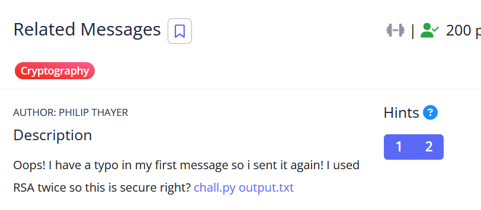

# [Related Messages]

* **CTF Name:** picoCTF 2026
* **Category:** Cryptography
* **Difficulty:** 200 points
* **Hint:**
    * How are the two messages related?
    * Franklin Reiter _______ _______ attack.
* **Challenge Author:** PHILIP THAYER
* **Writeup Author:** Nakata Christian (n4ctbyte)
* **Date:** March 16, 2026
* **Source:** [Link to Challenge](https://play.picoctf.org/events/79/challenges/713?category=2&page=1)

---

## Challenge Description



## 1. Executive Summary

**Objective:**
To decrypt a message that was encrypted twice using RSA with the same modulus N and a small exponent e, where the two plaintexts have a known linear relationship (a "typo").

**Result:**
The investigation identified that the two messages differed only by a constant value of 3. By applying the Franklin-Reiter Related Message Attack using SageMath, I recovered the original message. After correcting a minor ASCII offset caused by the typo, the flag was successfully recovered. Flag: `picoCTF{m3ssage_w1th_typ0}`.

**Method:**
The methodology involved identifying the linear relationship between the two messages, constructing two polynomials in the ring $\mathbb{Z}_N[x]$, and finding their Greatest Common Divisor (GCD) to isolate the plaintext.

---

## 2. Evidence Identification

This section provides details regarding the initial evidence file.

- **Filename:** `chall.py`
- **Size:** `408 Bytes`
- **SHA-256:** `ef70b1df3827c5c8804cb9fd74f75562f0e4a19bd61ccb0c4f58bad1eaec92cd`

- **Filename:** `output.txt`
- **Size:** `1.9 KB`
- **SHA-256:** `8308d06bbfdfcac53fc9e08b312a5b099ebff2f72d64f5c4b4afd603f3e5b5e7`

**Initial Check:**
Verifying file type using signature headers (Magic Bytes).

```bash
$ file chall.py
chall.py: Python script, ASCII text executable

$ file output.txt
output.txt: ASCII text, with very long lines (617)
```

---

## 3. Investigation Steps

### Step 1: Code Analysis

Reviewing `chall.py` reveals that the same modulus N and exponent e were used to encrypt two different but related messages.

**`chall.py` Source Code:**
```python
from Crypto.Util.number import getPrime, inverse, bytes_to_long, long_to_bytes, GCD

Message = bytes_to_long(b"[redacted]")
Message_fixed = bytes_to_long(b"[redacted]")
e = 0x11
p = getPrime(1024)
q = getPrime(1024)
phi = (p-1) * (q-1)
d = inverse(e, phi)
N = p*q

ciphertext = pow(Message, e, N)
ciphertext2 = pow(Message_fixed, e, N)

print(ciphertext, ciphertext2)
print(Message - Message_fixed)
print(N)
```

### Step 2: Parameter Extraction

The file `output.txt` contains the actual values for the two ciphertexts, the modulus N, and the crucial difference between the two plaintexts (k = −3).

**`output.txt:**
```plaintext
3486364849772584627692611749053367200656673358261596068549224442954489368512244047032432842601611650021333218776410522726164792063436874469202000304563253268152374424792827960027328885841727753251809392141585739745846369791063025294100126955644910200403110681150821499366083662061254649865214441429600114378725559898580136692467180690994656443588872905046189428367989340123522629103558929469463071363053880181844717260809141934586548192492448820075030490705363082025344843861901475648208157572346004443100461870519699021342998731173352225724445397168276113254405106732294978648428026500248591322675321980719576323749
201982790559548563915678784397933493721879152787419243871599124287434576744055997870874349538398878336345269929647585648144070475012256331468688792105087899416655051702630953882466457932737483198442642588375981620937494661378586614008496182135571457352400128892078765628319466855732569272509655562943410536265866312968101366413636251672211633011159836642751480632253423529271185888171036917413867011031963618529122680143291205470937752671602494831117301480813590683791618751348224964277861127486155552153012612562009905595646626759034581358425916638671884927506025703373056113307665093346439014722219878575598308124
-3
17334845546772507565250479697360218105827285681719530148909779921509619103084219698006014339278818598859177686131922807448182102049966121282308256054696565796008642900453901629937223685292142986689576464581496406676552201407729209985216274086331582917892470955265888718120511814944341755263650688063926284195007148056359887333784052944201212155189546062807573959105963160320187551755272391293705288576724811668369745107148481856135696249862795476376097454818009481550162364943945249601744881676746859305855091288055082626399929893610275614840617858985993338556889612804266896309310999363054134373435198031731045253881
```

### Step 3: Mathematical Derivation

Since e is small (17) and both plaintexts share the same modulus, we can use the Franklin-Reiter Related Message Attack. We define two polynomials in the ring $\mathbb{Z}_N[x]$ such that the original message M is their common root:

$$
f_1(x) = x^e - C_1 \pmod N
$$

$$
f_2(x) = (x + 3)^e - C_2 \pmod N
$$

By calculating the Greatest Common Divisor (GCD) of f1​ and f2​, we can isolate the linear factor (x−M), which reveals the original message.

### Step 4: Automating Decryption with SageMath

I developed a SageMath script to handle the polynomial arithmetic and GCD calculation.

**Solver Script:**
```python
from Crypto.Util.number import long_to_bytes

C1 = 3486364849772584627692611749053367200656673358261596068549224442954489368512244047032432842601611650021333218776410522726164792063436874469202000304563253268152374424792827960027328885841727753251809392141585739745846369791063025294100126955644910200403110681150821499366083662061254649865214441429600114378725559898580136692467180690994656443588872905046189428367989340123522629103558929469463071363053880181844717260809141934586548192492448820075030490705363082025344843861901475648208157572346004443100461870519699021342998731173352225724445397168276113254405106732294978648428026500248591322675321980719576323749
C2 = 201982790559548563915678784397933493721879152787419243871599124287434576744055997870874349538398878336345269929647585648144070475012256331468688792105087899416655051702630953882466457932737483198442642588375981620937494661378586614008496182135571457352400128892078765628319466855732569272509655562943410536265866312968101366413636251672211633011159836642751480632253423529271185888171036917413867011031963618529122680143291205470937752671602494831117301480813590683791618751348224964277861127486155552153012612562009905595646626759034581358425916638671884927506025703373056113307665093346439014722219878575598308124
N = 17334845546772507565250479697360218105827285681719530148909779921509619103084219698006014339278818598859177686131922807448182102049966121282308256054696565796008642900453901629937223685292142986689576464581496406676552201407729209985216274086331582917892470955265888718120511814944341755263650688063926284195007148056359887333784052944201212155189546062807573959105963160320187551755272391293705288576724811668369745107148481856135696249862795476376097454818009481550162364943945249601744881676746859305855091288055082626399929893610275614840617858985993338556889612804266896309310999363054134373435198031731045253881
e = 17
k = 3

R.<X> = PolynomialRing(Zmod(N))

f1 = X^e - C1
f2 = (X + k)^e - C2

def gcd_polynomial(poly1, poly2):
    while poly2:
        poly1, poly2 = poly2, poly1 % poly2
    return poly1.monic()

result = gcd_polynomial(f1, f2)
m = -result.coefficients()[0]

print(f"Flag: {long_to_bytes(int(m)).decode()}")
```

### Step 5: Flag Recovery

The script recovered the first message (M): `picoCTF{m3ssage_w1th_typ0z`.
From `output.txt`, we know Message−Message_fixed = −3, meaning Message_fixed = Message + 3. The character `z` has an ASCII value of 122. Correcting the typo by adding the difference: 122 + 3 = 125 (ASCII `}`). Final flag: `picoCTF{m3ssage_w1th_typ0}`.

---

## 4. Conclusion

The Franklin-Reiter attack proves that "Raw RSA" (RSA without padding) is inherently insecure when related messages are encrypted.

1. Small Exponent Danger: While e=65537 is standard, small exponents like e=17 make polynomial attacks computationally trivial.

2. Padding is Mandatory: Modern RSA implementations must use OAEP padding. Padding ensures that even messages differing by a single bit result in completely unrelated ciphertexts, neutralizing algebraic attacks like this one.