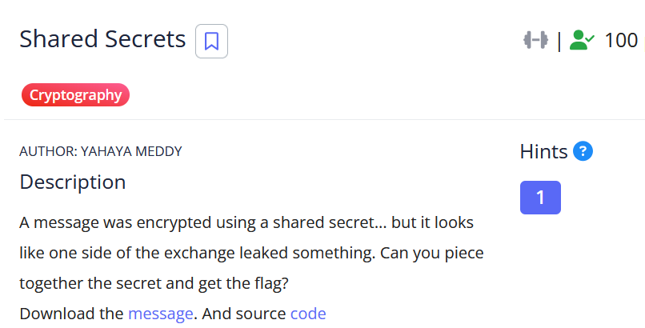

# [Shared Secrets]

* **CTF Name:** picoCTF 2026
* **Category:** Cryptography
* **Difficulty:** 100 points
* **Hint:** What do you get if you combine a public key with a known private one?
* **Challenge Author:** YAHAYA MEDDY
* **Writeup Author:** Nakata Christian (n4ctbyte)
* **Date:** March 16, 2026
* **Source:** [Link to Challenge](https://play.picoctf.org/events/79/challenges/715?category=2&page=1)

---

## Challenge Description



## 1. Executive Summary

**Objective:**
To decrypt a message encrypted using a Diffie-Hellman shared secret that was compromised due to the leakage of one of the private exponents.

**Result:**
The investigation identified that the client's private secret (b) was inadvertently included in the provided `message.txt`. By combining this leaked secret with the server's public key (A) using modular exponentiation, I reconstructed the shared secret and successfully decrypted the flag: `picoCTF{dh_s3cr3t_bd38f376}`.

**Method:**
The methodology involved analyzing the provided Python source code to understand the key exchange mechanism, followed by a mathematical derivation to calculate the shared secret without needing the server's private key (a).
---

## 2. Evidence Identification

This section provides details regarding the initial evidence file.

- **Filename:** `encryption.py`
- **Size:** `537 Bytes`
- **SHA-256:** `7a7b51dc40d74bdcc34baefa0c463275ca1330cdad482b798b8f3672fc57935c`

- **Filename:** `message.txt`
- **Size:** `1.1 KB`
- **SHA-256:** `ddda85a5fb9fbbaaa07db3423f1a82bb3a9ef250a55a84eb2534df5d5fb63c62`

**Initial Check:**
Verifying file type using signature headers (Magic Bytes).

```bash
$ file encryption.py
encryption.py: Python script, ASCII text executable

$ file message.txt  
message.txt: ASCII text, with very long lines (320)
```

---

## 3. Investigation Steps

### Step 1: Static Code Analysis

First, I analyzed `encryption.py` to understand the encryption mechanism. The script implements a standard Diffie-Hellman Key Exchange (DHKE) and uses the resulting shared secret to XOR the flag.

`encryption.py` **Code:**
```python
from Crypto.Util.number import getPrime
from random import randint

# Public parameters
g = 2
p = getPrime(1048)

# Server's secret
a = randint(2, p-2)
A = pow(g, a, p)

# Client secret
b = '???'  

B = pow(g, b, p)

# Shared key
shared = pow(A, b, p)

# Encrypt flag
flag = b"picoCTF{...}"
enc = bytes([x ^ (shared % 256) for x in flag])

# Write challenge info
with open("file.txt", "w") as f:
    f.write(f"g = {g}\n")
    f.write(f"p = {p}\n")
    f.write(f"A = {A}\n")
    f.write(f"b = {b} \n")
    f.write(f"enc = {enc.hex()}\n")
```

### Step 2: Extracting Parameters from `message.txt`

Upon inspecting the provided `message.txt`, I found all the necessary public parameters and, crucially, the leaked private value for b.

`message.txt`:
```plaintext
g = 2
p = 1653798930689987750372209240014380521131540183716217687164747711336243702962818359267822691525697642105558753651223568056089606926425342081267821725904109431430327153613733358950243154522848602494020618427146508586350079988809469424456886589329449769221123659126892760967096413248127035734431548987006011015808526671
A = 771122236020803078829911570090382183223626843114693013412703353349864301811612864849857638111588507084769437566078749825291937213523446695097948166153379036322108656350710200734137906115055446496743841090323252143278700024424965369059879247648625799137192258413471893876530475007392243768366999108564494255853654467
b = 502087552249276796768894199149546386713173741864561762918671131549146319658647813949433247424965048798816294966029262647803764533595143429273283374211302160540685383641060542870573303301014875733971557824236009184578986290165659257363419797500816452080900496604781986251988455903195756181696996025184087945715324970
enc = cfd6dcd0fcebf9c4dbd7e0cc8cdccd8ccbe0dddb8c87d98c8889c2
```

### Step 3: Mathematical Derivation

The security of DHKE relies on the difficulty of the Discrete Logarithm Problem (DLP). However, since b is known, we can bypass the DLP entirely. The shared secret can be calculated by raising the server's public key A to the power of the client's private key b:
$$\text{Shared} \equiv A^b \pmod p$$

By substituting A with its definition ($g^a \pmod p$), we can see how the secret is reconstructed:
$$\text{Shared} \equiv (g^a)^b \pmod p \equiv g^{ab} \pmod p$$

### Step 4: Automating Decryption

I implemented a Python script to calculate the shared secret and perform the XOR operation.

**Solver Script:**
```python
import binascii

# parameters from message.txt
g = 2
p = 16537989306899877503722092400143805211315401837162176871647477113362437029628183592678226915256976421055587536512235680560896069264253420812678217259041094314303271536137333589502431545228486024940206184271465085863500799888094694
A = 77112223602080307882991157009038218322362684311469301341270335334986430181161286484985763811158850708476943756607874982529193721352344669509794816615337903632210865635071020073413790611505544649674384109032325214327870002442496536
b = 50208755224927679676889419914954638671317374186456176291867113154914631965864781394943324742496504879881629496602926264780376453359514342927328337421130216054068538364106054287057330330101487573397155782423600918457898629016565925
enc_hex = "cfd6dcd0fcebf9c4dbd7e0cc8cdccd8ccbe0dddb8c87d98c8889c2"

shared = pow(A, b, p)
key = shared % 256
enc_bytes = bytes.fromhex(enc_hex)
flag = "".join([chr(x ^ key) for x in enc_bytes])

print(f"Key: {key}")
print(f"Flag: {flag}")

```

**Output:**
```bash
$ python3 a.py
Key: 191
Flag: picoCTF{dh_s3cr3t_bd38f376}
```

---

## 4. Conclusion

This challenge serves as a textbook example of how implementation flaws can nullify mathematical security.

1. Key Management Failure: Diffie-Hellman is robust, but the accidental inclusion of b in the output file (message.txt) allowed for an immediate compromise of the shared secret.

2. Deterministic Derivation: The use of `shared % 256` as an encryption key is highly insecure, though it was sufficient for the context of this challenge.