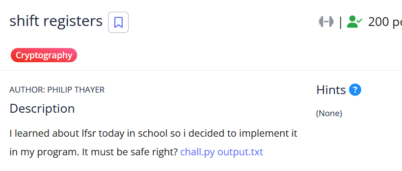

# [shift registers]

* **CTF Name:** picoCTF 2026
* **Category:** Cryptography
* **Difficulty:** 200 points
* **Hint:** None
* **Challenge Author:** Philip Thayer
* **Writeup Author:** Nakata Christian (n4ctbyte)
* **Date:** March 17, 2026
* **Source:** [Link to Challenge](https://play.picoctf.org/events/79/challenges/716?category=2&page=1)

---

## Challenge Description



## 1. Executive Summary

**Objective:**
To decrypt a ciphertext encrypted with a Linear Feedback Shift Register (LFSR) stream cipher by identifying and exploiting a significant reduction in the encryption key's state space.

**Result:**
The investigation identified that while the program generates a 126-byte random key, it only utilizes the final 8 bits to seed the LFSR due to an insecure masking operation (key&0xFF). This limited the entropy to 256 possible states. By brute-forcing all potential 8-bit seeds, the keystream was recovered, revealing the flag: `picoCTF{l1n3ar_f33dback_sh1ft_r3g}`.

**Method:**
The methodology involved static code analysis to pinpoint the entropy loss, mathematical simulation of the LFSR stepping function, and an automated brute-force attack to identify the correct initial state.
---

## 2. Evidence Identification

This section provides details regarding the initial evidence file.

- **Filename:** `chall.py`
- **Size:** `650 Bytes`
- **SHA-256:** `77b37b7be4dfeaea5d87246e6ddad85b7e0bb8905989b7ea360072c44bbb733e`

- **Filename:** `output.txt`
- **Size:** `69 Bytes`
- **SHA-256:** `3c0865c71738d7ab8d44081c3eb5c5bd92cd4417f871989275722522d8944e29`

**Initial Check:**
Verifying file type using signature headers (Magic Bytes).

```bash
$ file chall.py  
chall.py: Python script, ASCII text executable

$ file output.txt
output.txt: ASCII text

```

---

## 3. Investigation Steps

### Step 1: Code Analysis

First, I examined the source code to understand how the LFSR is initialized and used for encryption.

**`chall.py` Code:**
```python
from Crypto.Util.number import bytes_to_long, long_to_bytes
from Crypto.Random import get_random_bytes

key = bytes_to_long(get_random_bytes(126))

def steplfsr(lfsr):
    b7 = (lfsr >> 7) & 1
    b5 = (lfsr >> 5) & 1
    b4 = (lfsr >> 4) & 1
    b3 = (lfsr >> 3) & 1

    feedback = b7 ^ b5 ^ b4 ^ b3
    lfsr = (feedback << 7) | (lfsr >> 1)
    return lfsr

def encrypt_lfsr(pt_bytes):
    output = bytearray()
    lfsr = key & 0xFF # CRITICAL VULNERABILITY
    for p in pt_bytes:
        lfsr = steplfsr(lfsr)
        ks = lfsr
        output.append(p ^ ks)
    return bytes_to_long(bytes(output))

pt = b"[redacted]"
ct = encrypt_lfsr(pt)

print(long_to_bytes(ct).hex())
```
**Observation:**
The variable `key` is 126 bytes (1008 bits), which should be cryptographically secure. However, the line `lfsr = key & 0xFF` discards 1000 bits of entropy, leaving only 8 bits (1 byte) as the initial state for the LFSR. This reduces the search space to only 2^8 = 256 possible seeds.

### Step 2: Extracting Parameters

The `output.txt` contains the hex-encoded ciphertext generated by the `encrypt_lfsr`function.

`output.txt`:
```plaintext
21c1b705764e4bfdafd01e0bfdbc38d5eadf92991cdd347064e37444e517d661cea9
```

### Step 3: Mathematical Simulation

The `steplfsr` function implements a linear feedback mechanism. The feedback bit is calculated by XORing specific "taps" (bits 7, 5, 4, and 3):

$$
feedback = b_7 \oplus b_5 \oplus b_4 \oplus b_3
$$

The new state is then derived by shifting the existing state to the right and inserting the feedback bit into the most significant bit (MSB):

$$
lfsr_{new} = (feedback \ll 7) \mid (lfsr_{old} \gg 1)
$$

### Step 4: Brute-Force Solution

Since there are only 256 possible seeds, I wrote a Python script to simulate the LFSR and attempt decryption for every possible starting value.

**Solver Script:**
```python
def steplfsr(lfsr):
    b7 = (lfsr >> 7) & 1
    b5 = (lfsr >> 5) & 1
    b4 = (lfsr >> 4) & 1
    b3 = (lfsr >> 3) & 1

    feedback = b7 ^ b5 ^ b4 ^ b3
    lfsr = ((feedback << 7) | (lfsr >> 1)) & 0xFF
    return lfsr

ct_hex = "21c1b705764e4bfdafd01e0bfdbc38d5eadf92991cdd347064e37444e517d661cea9"
ct_bytes = bytes.fromhex(ct_hex)

for seed in range(256):
    lfsr = seed
    res = bytearray()
    for c in ct_bytes:
        lfsr = steplfsr(lfsr)
        res.append(c ^ lfsr)
    
    if b"picoCTF{" in res:
        print(f"Found Seed: {seed}")
        print(f"Flag: {res.decode()}")
        break
```

**Output:**
```bash
Found Seed: 162
Flag: picoCTF{l1n3ar_f33dback_sh1ft_r3g}
```

---

## 4. Conclusion

This challenge serves as a textbook example of how poor implementation can nullify strong cryptographic primitives.

1. **Entropy Loss:** Utilizing only 8 bits of a 1008-bit key makes the system trivial to break via exhaustive search.

2. **Stream Cipher Security:** The security of an LFSR-based stream cipher depends entirely on the secrecy and size of the initial state. If the state can be brute-forced, the entire keystream is compromised.