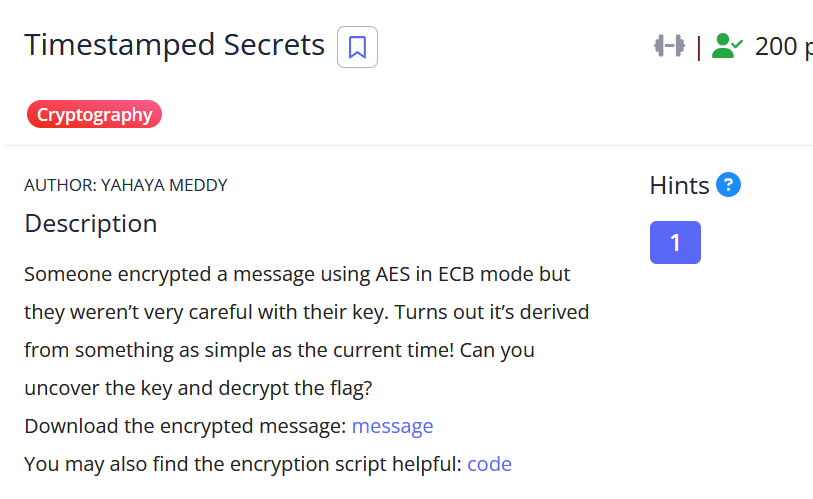

# [Timestamped Secrets]

* **CTF Name:** picoCTF 2026
* **Category:** Cryptography
* **Difficulty:** 200 points
* **Hint:** encryption.py is a redacted example of the program
* **Challenge Author:** YAHAYA MEDDY
* **Writeup Author:** Nakata Christian (n4ctbyte)
* **Date:** March 14, 2026
* **Source:** [Link to Challenge](https://play.picoctf.org/events/79/challenges/722?category=2&page=1)

---

## Challenge Description



## 1. Executive Summary

**Objective:**
To decrypt a message encrypted with AES-ECB where the 128-bit key was derived from a predictable Unix timestamp.

**Result:**
The investigation identified that the encryption key was a SHA-256 hash of the Unix timestamp `1770242615`. By brute-forcing a small range of timestamps around the provided hint, the correct key was found and the flag was decrypted. The decrypted flag is: `picoCTF{sa3S_sEc9t_fbbd0fb7}`.

**Method:**
The methodology involved analyzing the provided Python script to reverse the key derivation function (KDF) and performing a temporal brute force attack using a custom Python script to iterate through potential timestamps and validate the decryption results.

---

## 2. Evidence Identification

This section provides details regarding the initial evidence file.

- **Filename:** `message.txt`
- **Size:** `135 Bytes`
- **SHA-256:** `957132d698d52983de2737a15f0542a68ae01aa6355944bd8ea85cb1fe7b6e3f`

- **Filename:** `encryption.py`
- **Size:** `629 Bytes`
- **SHA-256:** `9315674857bd1f62dc4d4b90d595060954a5d6d3f9fa3dd268d58a292bbe963b`

**Initial Check:**
Verifying file type using signature headers (Magic Bytes).

```bash
$ file message.txt  
message.txt: ASCII text

$ file encryption.py
encryption.py: Python script, ASCII text executable
```

---

## 3. Investigation Steps

### Step 1: Analyzing the Source Code

By inspecting the provided `encryption.py`, I identified that the AES-128 key is derived from a Unix timestamp at the moment of encryption. The script redacts the actual timestamp but shows the logic:

```python
from hashlib import sha256
import time
from Crypto.Cipher import AES
from Crypto.Util.Padding import pad

def encrypt(plaintext: str, timestamp: int) -> str:
    timestamp = int(time.time())
    key = sha256(str(timestamp).encode()).digest()[:16]
    cipher = AES.new(key, AES.MODE_ECB)
    padded = pad(plaintext.encode(), AES.block_size)
    ciphertext = cipher.encrypt(padded)
    return ciphertext.hex()

if __name__ == "__main__":
  
    plaintext = "picoCTF{...}"
    result = encrypt(plaintext, key)
    print(f"Hint: The encryption was done around {timestamp} UTC\n")
    print(f"Ciphertext (hex): {ciphertext.hex()}\n")
```

The use of `time.time()` as a key source is a critical vulnerability because Unix timestamps are predictable and have very low entropy when a general timeframe is known.

### Step 2: Extracting Parameters

The output file `message.txt` provided the necessary parameters for the attack:

```plaintext
Hint: The encryption was done around 1770242615 UTC
Ciphertext (hex): 24823b2b2d104b36ad2078cafc8d98f22488e78df83b29f507d9b910ad51a464
```

### Step 3: Determining the Optimal Attack Path

Since the hint provides a specific timestamp, the search space for the key is extremely small. Instead of a standard AES brute force (which is impossible), I performed a Temporal Brute Force. By checking a range of timestamps (seconds) around the hint, the correct key can be generated in milliseconds.

### Step 4: Automating the Recovery

I implemented a solver script to iterate through timestamps in a ±120 second range from the hint, generating the SHA-256 derived key for each and attempting AES-ECB decryption.

**Solver Script:**
```python                     
from hashlib import sha256
from Crypto.Cipher import AES
from Crypto.Util.Padding import unpad

ciphertext_hex = "24823b2b2d104b36ad2078cafc8d98f22488e78df83b29f507d9b910ad51a464"
ciphertext = bytes.fromhex(ciphertext_hex)
hint_timestamp = 1770242615

for offset in range(-120, 121):
    ts = hint_timestamp + offset
    key = sha256(str(ts).encode()).digest()[:16]
    cipher = AES.new(key, AES.MODE_ECB)
    try:
        decrypted = cipher.decrypt(ciphertext)
        if b"picoCTF" in decrypted:
            print(f"\nTIMESTAMP: {ts}")
            flag = unpad(decrypted, AES.block_size).decode()
            print(f"Flag: {flag}")
            break
    except:
        continue

print("\n[*] Done.")
```

### Step 5: Flag Decryption

Running the script successfully recovered the key at the exact hint timestamp.

**Terminal Output:**
```bash
$ python3 a.py
TIMESTAMP: 1770242615
Flag: picoCTF{sa3S_sEc9t_fbbd0fb7}

[*] Done.
```

---

## 4. Conclusion

This challenge highlights the dangers of using predictable seeds or system time for cryptographic key generation.

1. **Broken Entropy:** Cryptographic keys must be generated using a CSPRNG (Cryptographically Secure Pseudo-Random Number Generator). Using `time.time()` allows an attacker to reconstruct the key with minimal effort.

2. **Predictable KDF:** Deriving the key directly from a simple string-encoded integer further lowers the barrier for exploitation.