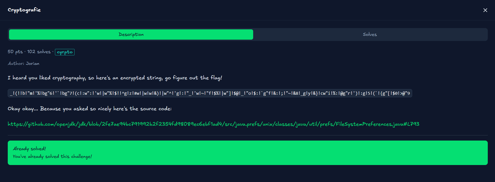

# [cryptografie]

* **CTF Name:** plfanzenctf 2026
* **Category:** Cryptography
* **Hint:** Okay okay... Because you asked so nicely here's the source code: [Source Code](https://github.com/openjdk/jdk/blob/2fe7ae94bc791992b2f2354fd98089ec6ebf1ad4/src/java.prefs/unix/classes/java/util/prefs/FileSystemPreferences.java#L793)
* **Challenge Author:** Jorian
* **Writeup Author:** Nakata Christian (n4ct)
* **Date:** May 10, 2026

---

## Challenge Description



## 1. Executive Summary

**Objective:**
To decode a bizarrely formatted string masquerading as ciphertext by analyzing the provided internal Java library source code and exploiting its built-in decoding mechanisms.

**Result:**
The challenge was less about traditional cryptographic mathematics (like RSA or AES) and more about reverse engineering an obscure encoding scheme. The provided string was actually an `altBase64` representation used by Java to safely name Unix directories when saving system preferences. By utilizing Java Reflection to bypass access modifiers, I hijacked the private `nodeName` decoder method natively present in the library to instantly recover the flag.

**Method:**
The approach involved reading the `FileSystemPreferences.java` source code to pinpoint the `dirName` (encoder) and `nodeName` (decoder) methods. Since `nodeName` is a `private` method, I wrote a custom Java script utilizing `java.lang.reflect.Method` to forcefully invoke it on the ciphertext. Finally, I bypassed modern Java module security constraints using JVM execution flags to allow the reflection to succeed.

---

## 2. Evidence Identification

Target files provided by the organizers:

- **Filename:** `FileSystemPreferences.java` (The internal Java library source code containing the custom encoding and decoding logic)

---

## 3. Investigation Steps

### Step 1: Initial Thought & Reading the Source

At first glance, the ciphertext looks like custom XOR garbage or an esoteric esolang. However, the author explicitly handed over the source code for `java.util.prefs.FileSystemPreferences`. When reading massive enterprise codebases, looking for keywords like "encode", "decode", "String", or "format" is usually the fastest route. Scanning the file, I noticed a block of code dealing with directory names:

```java
/**
     * Returns the directory name corresponding to the specified node name.
     * Generally, this is just the node name.  If the node name includes
     * inappropriate characters (as per isDirChar) it is translated to Base64.
     * with the underscore  character ('_', 0x5f) prepended.
     */
    private static String dirName(String nodeName) {
        for (int i=0, n=nodeName.length(); i < n; i++)
            if (!isDirChar(nodeName.charAt(i)))
                return "_" + Base64.byteArrayToAltBase64(byteArray(nodeName));
        return nodeName;
    }
```

This was the smoking gun. The comment states that if a preference node name contains unsafe Unix characters, Java encodes it into `altBase64` and prepends an underscore (`_`). The given ciphertext perfectly matches this exact signature!

### Step 2: Locating the Decoder

If `dirName` is the encoder, there must be a decoder to read the preferences back. Right below it in the source code is the inverse function:

```java
/**
     * Returns the node name corresponding to the specified directory name.
     * (Inverts the transformation of dirName(String).
     */
    private static String nodeName(String dirName) {
        if (dirName.charAt(0) != '_')
            return dirName;
        byte a[] = Base64.altBase64ToByteArray(dirName.substring(1));
        StringBuffer result = new StringBuffer(a.length/2);
        // ... byte reconstruction logic ...
        return result.toString();
    }
```

The `nodeName` function is exactly what we need. However, we can't just import this class and call `nodeName()` because it is declared as `private`.

### Step 3: Weaponizing Java Reflection

To bypass the `private` access modifier, I turned to Java Reflection. Reflection allows a running Java program to examine or modify the runtime behavior of applications, including accessing private fields and methods.

I wrote a short script that:
1. Loads the target class (`java.util.prefs.FileSystemPreferences`).
2. Targets the specific method (`nodeName`).
3. Forces it to be accessible via `setAccessible(true)`.
4. Invokes the method, passing the challenge string as the argument.

### Step 4: Bypassing Module Encapsulation (JEP 396)

When I compiled and ran the script, it threw a massive error:

`java.lang.reflect.InaccessibleObjectException: Unable to make private static java.lang.String...`

This happened because newer versions of Java (Java 9+, strictly enforced in 16+) heavily restrict Reflection access to internal APIs via the Java Platform Module System (JPMS). To break through this security layer, I simply had to add the `--add-opens` flag to the JVM during execution. This flag explicitly tells the JVM to open the `java.util.prefs` module to the unnamed module (our script), allowing Reflection to do its job.

### Step 5: Crafting the Final Exploit

**Solver Script:**

```java
import java.lang.reflect.Method;

public class b {
    public static void main(String[] args) throws Exception {
        String encrypted = "_!(!!b!\"m!'%!bg\"6!'`!bg\"7!(c!:w\":!'w!|w\"%!$!!^g!z!#w!|w!w!&)!|w\"^!'g!:!\"_!'w!~!\"f!$%!|w\"]!$@!_!\"o!$:!`g\"f!&:!;!\"~!&8!_g!y!&}!cw\"i!%:!@g\"r!')!:g!5!(`!{g\"[!$0!>@\"9";
        Class<?> prefsClass = Class.forName("java.util.prefs.FileSystemPreferences");
        Method decodeMethod = prefsClass.getDeclaredMethod("nodeName", String.class);
        decodeMethod.setAccessible(true); 
        String flag = (String) decodeMethod.invoke(null, encrypted);
        System.out.println(flag);
    }
}
```

**Compilation and Output:**

```bash
─$ javac b.java                                             

─$ java --add-opens java.prefs/java.util.prefs=ALL-UNNAMED b
plfanzen{w3Ll_D0N3,_0R_Sh0Uld_1_R4Th3R_S4Y_V2VsbCBkb29uZQ==}
```

---

## 4. Conclusion

This challenge was a fantastic reminder that "cryptography" in the wild isn't always about prime numbers and elliptic curves. Sometimes, it's just about developers inventing obscure, undocumented encoding wrappers for internal system mechanics.

Instead of painstakingly reverse-engineering the `altBase64` bit-shifting logic manually, utilizing Java's own Reflection API allowed the library to do the heavy lifting for us. As a fun easter egg, the author included a standard Base64 string at the end of the flag (`V2VsbCBkb29uZQ==`), which decodes to "Well doone". A clever, programmatic puzzle!