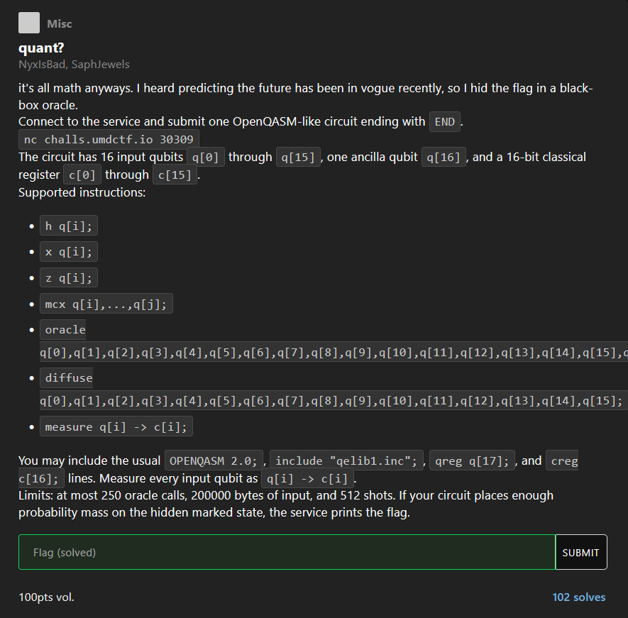

# [quant]

* **CTF Name:** UMD CTF 2026
* **Category:** Misc
* **Hint:** It's all math anyways. I heard predicting the future has been in vogue recently, so I hid the flag in a black-box oracle.
* **Challenge Author:** NyxIsBad, SaphJewels
* **Writeup Author:** Nakata Christian (n4ct)
* **Date:** April 26, 2026

---

## Challenge Description



## 1. Executive Summary

**Objective:**
To find a hidden 16-bit state inside a quantum black-box oracle within a strict limit of 250 oracle calls, using OpenQASM-like syntax.

**Result:**
Successfully retrieved the hidden 16-bit string (`0110010101111010`) with a 100% probability rate (512 out of 512 counts). The extracted flag is `UMDCTF{0110010101111010}`.

**Method:**
This is a textbook application of Grover's Algorithm. Classically, brute-forcing a 16-bit value takes up to 65,536 tries, which heavily exceeds the 250 calls limit. By writing a Python script to generate a quantum circuit that leverages superposition, phase kickback, and amplitude amplification (`diffuse`), we can mathematically shrink the required search attempts to just 201 iterations.

---

## 2. Evidence Identification

This section provides details regarding the initial evidence file.

- **Target**: `nc challs.umdctf.io 30309`
- **Input Format:** OpenQASM 2.0 instructions over a TCP socket.
- **Environment Limits:**
    - Search space: 16 qubits (65,536 possible states)
    - Maximum oracle calls: 250
    - Measurement shots: 512

---

## 3. Investigation Steps

### Step 1: The Quantum Advantage

The server limits us to 250 oracle queries to guess a 16-bit combination. In a classical computing world, finding one specific item in an unstructured database of 65,536 items takes an average of N/2 or about 32,768 attempts. Since we only have 250 tries, it's impossible. However, using Grover's algorithm on a quantum computer allows us to find the target in $O(\sqrt{N})$ steps. The optimal number of iterations to get the highest probability is calculated as:

$$\text{Iterations} \approx \frac{\pi}{4} \sqrt{65536} = \frac{\pi}{4} \times 256 \approx 201$$

Since 201 is well under the 250 limit, we have a solid path forward.

### Step 2: Running the Exploit

Writing 201 iterations of quantum assembly by hand is a bad idea. Instead, we can whip up a quick Python script to generate the payload and pipe it directly to the server.

The circuit follows the standard Grover's routine:
1. **Ancilla Setup:** Flip the ancilla qubit (`q[16]`) to the $|-\rangle$ state for phase kickback during the oracle call.

2. **Superposition:** Apply a Hadamard gate (`h`) to all 16 input qubits to evaluate all 65,536 states simultaneously.

3. **Amplification Loop:** Call `oracle` to invert the phase of the correct answer, then `diffuse` to amplify its probability. Do this exactly 201 times.

4. **Measurement:** Measure the collapsed state.

**Solver Script:**
```python
import sys

qasm = [
    'OPENQASM 2.0;',
    'include "qelib1.inc";',
    'qreg q[17];',
    'creg c[16];'
]

qasm.append('x q[16];\nh q[16];')

for i in range(16):
    qasm.append(f'h q[{i}];')

oracle_args = ','.join([f'q[{i}]' for i in range(17)])
diffuse_args = ','.join([f'q[{i}]' for i in range(16)])

for _ in range(201):
    qasm.append(f'oracle {oracle_args};')
    qasm.append(f'diffuse {diffuse_args};')

for i in range(16):
    qasm.append(f'measure q[{i}] -> c[{i}];')

qasm.append('END')

print('\n'.join(qasm))
```

### Step 3: Extracting the Flag

By piping our Python output directly into `netcat`, the server parses our OpenQASM circuit, simulates the quantum states, and gives us the measurement results.

**Execution:**
```bash
$ python3 a.py | nc challs.umdctf.io 30309 
qisket oracle service
input qubits: q[0]..q[15], ancilla: q[16]
max oracle calls: 250, shots: 512
send an OpenQASM-like program, then a line containing only END
supported: h, x, z, mcx, oracle, diffuse, measure
oracle call: oracle q[0],q[1],q[2],q[3],q[4],q[5],q[6],q[7],q[8],q[9],q[10],q[11],q[12],q[13],q[14],q[15],q[16];
diffuser helper: diffuse q[0],q[1],q[2],q[3],q[4],q[5],q[6],q[7],q[8],q[9],q[10],q[11],q[12],q[13],q[14],q[15];
measure every input qubit as q[i] -> c[i]

counts:
0110010101111010: 512
UMDCTF{0110010101111010}
```

Because we hit the exact optimal number of iterations, the probability mass shifted almost entirely to the correct state. Out of 512 shots, all 512 measured the exact same string.

---

## 4. Conclusion

This challenge elegantly demonstrates the practical power of quantum algorithms over classical limitations. By restricting the query count far below the threshold required for classical brute-forcing, the challenge forced us to use Grover's algorithm to manipulate quantum probabilities. Using phase inversion and amplitude amplification, we effectively bypassed the strict oracle limit and pulled the flag right out of the black box.