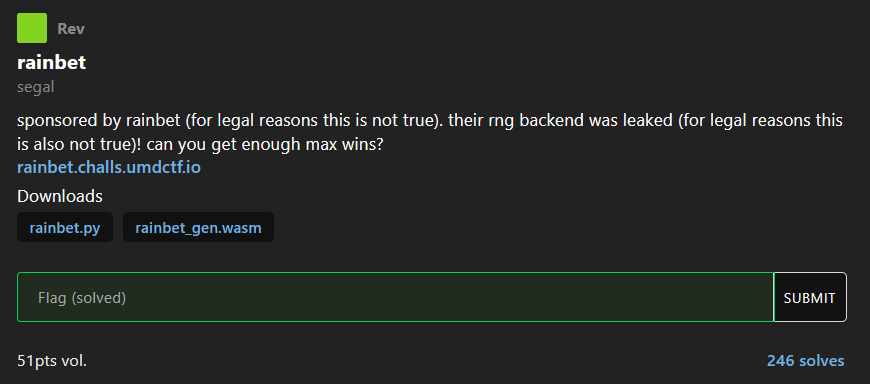

# [rainbet]

- **CTF Name:** UMDCTF 2026
- **Category:** Reverse
- **Hint:** sponsored by rainbet (for legal reasons this is not true). their rng backend was leaked (for legal reasons this is also not true)! can you get enough max wins?
- **Challenge Author:** segal
- **Writeup Author:** Nakata Christian (n4ct)
- **Date:** April 26, 2026

---

## Challenge Description



## 1. Executive Summary

**Objective:**
To manipulate the Random Number Generator (RNG) system of a mock online casino to predict the safe spots in the Mines game and the crash points in the Chicken game, aiming to secure a flawless 25-win streak and grab the flag.

**Result:**
The core vulnerability lies in the WASM generation algorithm, which is 100% deterministic and relies entirely on the `session_id` and round index. Instead of reverse-engineering the WASM or spoofing the WebSocket signature on the frontend, I used a local Python script as an "Oracle" to predict the game's outcome. These predictions were then automatically executed via a JavaScript DOM manipulation script directly in the browser's console, successfully yielding the flag: `UMDCTF{one_might_argue_that_gambling_is_the_best_vice_but_they_would_be_wrong}`.

**Method:**
The approach involved analyzing the Python wrapper that calls the WASM module, inspecting WebSocket traffic to extract the `session_id`, crafting a Python script to leak the obstacles, and injecting a JavaScript auto-clicker into the browser to handle the execution while bypassing rate limits.

---

## 2. Evidence Identification

Target files provided by the organizers:

- **Filename:** `rainbet.py` (Python wrapper)
- **Filename:** `rainbet_gen.wasm` (Compiled WebAssembly RNG logic)
- **Target Instance:** `rainbet.challs.umdctf.io`

---

## 3. Investigation Steps

### Step 1: Initial Thought

Imagine walking into a rigged casino where the house always wins. In UMDCTF 2026, the "Rainbet" challenge dropped us right into a mock crypto-gambling platform. The objective was simple but mathematically daunting: achieve a "Max Win" 25 times in a row across a mix of Mines and Chicken (Crash) games. One wrong click, and your streak resets to zero.

The organizers, however, threw us a massive bone: they "accidentally" leaked their RNG backend. We were handed a Python wrapper (`rainbet.py`) and a compiled WebAssembly binary (`rainbet_gen.wasm`). We had the casino's brain, we just needed to figure out how to read its thoughts.

### Step 2: The Illusion of Randomness

My first step was examining the leaked Python wrapper to understand how to game state was generated. Deep inside this code, a specific function stood out:

```python
def _call_generate(session_id: str, round_idx: int) -> bytes:
    # ... calls the "generate" export from the WASM module
```

This tiny snippet was the smoking gun. It proved that the game's "Random Number Generator" wasn't random at all. The WASM logic was purely deterministic. As long as you know two variables, the session_id and the current round number (round_idx). The WASM binary will spit out the exact same bomb placements or crash multipliers every single time.

I didn't need to decompile the WASM to reverse the math. I already had the exact oracle the server was using. If I ran this locally, I could see the future.

### Step 3: The WebSocket Trap

With the oracle in hand, my initial plan was to write a classic Python pwntools or requests script to fire safe moves at the server at lightning speed. But the casino had a bouncer at the door.

When I opened the browser's Developer Tools and peeked at the Network tab, I realized there were no HTTP POST requests happening when I played. The entire game was communicating over a continuous WebSocket connection.

To make matters worse, I inspected the WebSocket payloads and found this:
`{"action":"reveal", "view":"mines:0:7:7:0", "sig":"b41425fc71311d026536..."}`.

Every single click was cryptographically signed (sig). Attempting to write a Python bot meant I would have to reverse-engineer the obfuscated frontend JavaScript to figure out the hashing algorithm just to forge valid requests. That was a rabbit hole I had no intention of going down.

Modern crypto-casino frontends are typically built with heavy frameworks like React or Vue, and the resulting JavaScript is heavily minified and obfuscated by bundlers like Webpack. The `sig` generation likely involves hashing a combination of the action payload, a hidden client-side salt, and a timestamp. Statically analyzing megabytes of obfuscated JavaScript to reconstruct this proprietary hashing algorithm locally would take hours—time that in a CTF, is better spent finding logic flaws.

Then it hit me: Why fight the frontend when I can use it as my weapon? The browser already knows how to generate the signature. I just needed to tell the browser what to click.

### Step 4: Crafting the Time Machine

I pivoted my strategy. I extracted my `session_id` (`id=fd2fcba140236372`) from the initial WebSocket handshake headers. With this, I wrote a Python script to look 25 rounds into the future and dump the answers in a format the browser could understand: a JavaScript array.

During testing, I discovered a hidden pitfall. The server dictates the grid size and bomb count for each round. If your UI doesn't match the server's secret expectation, your streak is instantly voided. So, I updated my oracle to leak the required UI parameters as well:

```python
import rainbet

session_id = "fd2fcba140236372" # The hijacked WebSocket cookie

print("const cheatsheet = [")
for round_idx in range(25):
    game = rainbet.generate_game(session_id, round_idx)

    if game["type"] == "mines":
        bombs = sorted(game["mines"])
        grid_ui = game['grid_size'] ** 2
        print(f"  {{ type: 'mines', grid_ui: {grid_ui}, mines_count: {game['num_mines']}, bombs: {bombs} }},")
    else:
        val = rainbet.max_safe_steps(game["cars"])
        print(f"  {{ type: 'chicken', risk: '{game['risk']}', cash_out: {val} }},")
print("];")
```

### Step 5: The Ghost in the DOM

Even with the answers, manually clicking over 40 safe tiles per round for 25 rounds was a recipe for human error. A single misclick meant starting over.

To automate the execution, I took the JavaScript array generated by my Python script and paired it with a custom asynchronous auto-clicker. I injected this directly into the browser's Developer Console.

```javascript
// Data 'cheatsheet' pasted from Python output
// const cheatsheet = [ ... ];

async function clearMines(round) {
  let data = cheatsheet[round];

  // Fallback for manual Chicken rounds
  if (data.type !== "mines") {
    console.log(
      `[CHICKEN] Set UI Risk to: ${data.risk} | Cash out at step: ${data.cash_out}`,
    );
    return;
  }

  console.log(
    `[MINES] Set UI -> Grid: ${data.grid_ui} | Bombs: ${data.mines_count}`,
  );

  // Select all playable tiles on the grid
  let tiles = document.querySelectorAll(".grid-item-hover");

  for (let i = 0; i < tiles.length; i++) {
    // If the tile index is NOT in the bomb list, click it
    if (!data.bombs.includes(i)) {
      tiles[i].click();
      // Critical bypass: 100ms delay to prevent server rate-limiting and DOM staleness
      await new Promise((r) => setTimeout(r, 100));
    }
  }
}
```

The `await new Promise(r => setTimeout(r, 100))` was the most critical bypass mechanism. Modern frontends manage state virtually (e.g., React's Virtual DOM). If a script injects 40 synchronous clicks in 1 millisecond, the frontend state manager batches them, overriding the previous states, or the backend's WAF drops the sudden burst of WebSocket frames, recognizing it as a bot sequence. The 100ms delay acts as a throttle, tricking the Virtual DOM into smoothly rendering each tile flip and keeping our WebSocket packet velocity under the server's spam radar.

With everything in place, the execution was beautiful. I checked the console for the required UI settings, adjusted the web interface, placed the bet, and typed clearMines(0) into the console.

I watched as the tiles systematically flipped themselves, revealing diamonds while perfectly dancing around the bombs. Once the board was cleared, I cashed out. I repeated this dance, typing clearMines(1), clearMines(2), navigating through Mines and manual Chicken rounds exactly as the oracle prophesied.

At round 25, the streak counter maxed out, the WebSocket received its final payload, and the flag was finally rendered on screen: `UMDCTF{one_might_argue_that_gambling_is_the_best_vice_but_they_would_be_wrong}`.

---

## 4. Conclusion

This challenge perfectly illustrates the concept of the 'Path of Least Resistance' in vulnerability research. While one could theoretically spend hours reverse-engineering the cryptographic signature algorithm, side-channeling the UI via DOM manipulation bypasses the need for cryptography entirely. Why pick a heavily guarded lock when the window is wide open?
