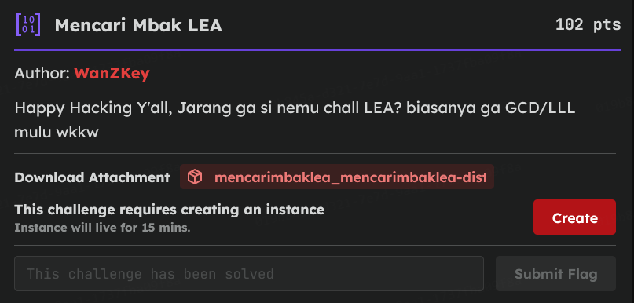

# [Mencari Mbak LEA]

* **CTF Name:** Vincoo CTF
* **Category:** Cryptography
* **Difficulty:** 102 pts
* **Hint:** None
* **Challenge Author:** WanZKey
* **Writeup Author:** Nakata Christian (n4ctbyte)
* **Date:** January 31, 2026
* **Source:** [Link to Challenge](https://tcp.1pc.tf/games/22/challenges#497-Mencari-Mbak-LEA)
* **File Source:** [Link to File](https://tcp.1pc.tf/assets/4fb8753715349fe3f777d286e50ed782a2e9c208b197c8f7ee39479a82219fd9/s/CfDJ8PBiKR2NsZFKsICZj0IlmeSQmVz_R4z-lCInG2gux2h90BKwEjnW4mpI87yl4FZ9OcsZgRzHJdxPeT68HzFxwpaelX87nKi7vps0HKIoOf-u2g5INSMLgcsho-ecqtPbW_TmJAQH368g5O1Yu1c7Qsliop_t4TM24xyUc1prStlJ0ZCgTDOs7Q_bX1XIFi3iamPK1fAmMA7D3rw-R9Cz-w2Kr112RDJISbfJLCiDnY7Xm-spSaIn3grzxW72AXjKCK_M4AWjFSbOjbSgbbwtVWk/mencarimbaklea_mencarimbaklea-dist.zip)

---

## Challenge Description



## 1. Executive Summary

**Objective:**
To bypass a Message Authentication Code (MAC) system implemented as H(secret||data) by exploiting a Length Extension Attack (LEA). The goal is to forge valid signatures for MD5, SHA1, SHA256, and SHA512 sequentially to retrieve the flag.

**Result:**
By manipulating the internal state of the hash functions using the `hashpumpy` library, I successfully appended the required payload to the secret without knowing the secret itself. I overcame specific library limitations regarding "empty original data" by implementing a custom "Length Compensation" logic. The retrieved flag is: `VincooCTF{c0NGrA75!_SEk4RAng_KaMu_6e1AjAr_1i6hTwEIgHT_ENcrYp7ioN_AI9ORiTHM}`.

**Method:**
The exploit utilizes the Merkle-Damgard construction vulnerability found in the targeted hash families. A Python solver was developed using `hashpumpy`. To bypass the library's refusal to handle empty data strings, I devised a method involving a fake secret length and a dummy byte to produce mathematically identical padding.

---

## 2. Evidence Identification

This section provides details regarding the initial evidence file.

- **Filename:** `mencarimbaklea_mencarimbaklea-dist/server.py`
- **Size:** `1.2 KB`
- **SHA-256:** `75168674f22609d8edc6368fce7b919888936cca0736ef533838da4410ab51fe`

**Initial Check:**
Verifying file type using signature headers (Magic Bytes).

```bash
$ file server.py                                  
server.py: Python script, ASCII text executable
```

---

## 3. Investigation Steps

### Step 1: Identifying the Attack Vector

The server requires us to input `evil_text` and `evil_hash`. Since we know the length of the secret (16) and the output of the hash, we can calculate the padding used by the hash algorithm to fill the block. We can then append our own data (`"Bagi flagnya dong om..."`) and resume the hash calculation from the previous state. This is a textbook Length Extension Attack.

**Full Code:**
```python
#!/usr/bin/python3
import os
import sys
from hashlib import *

FLAG = os.getenv("FLAG", "VincooCTF{FakeFlagOm}").encode()

def hash1(x: bytes):
    return md5(x).digest()

def hash2(x: bytes):
    return sha1(x).digest()

def hash3(x: bytes):
    return sha256(x).digest()

def hash4(x: bytes):
    return sha512(x).digest()

def challenge(hash):
    m = os.urandom(16)
    print(f"hash: {hash(m).hex()}")
    sys.stdout.flush() 
    
    try:
        evil_text = bytes.fromhex(input().strip()) 
        evil_hash = bytes.fromhex(input().strip())
    except:
        print("Format input harus hex string!")
        return False

    if hash(m + evil_text) != evil_hash:
        print("Eror Woy!!")
        return False
    if b"Bagi flagnya dong om..." not in evil_text:
        print("Wlekk salah lu wok?")
        return False
    return True

def challenges():
    sys.stdout.reconfigure(line_buffering=True)
    
    for h in [hash1, hash2, hash3, hash4]:
        if not challenge(h):
            print("Nub Banget lu Coy!")
            return
    print(f"Ni flagnya wok!: {FLAG.decode()}")

if __name__ == "__main__":
    challenges()
```

**Vulnerable Code Snippet:**
```python
def challenge(hash):
    m = os.urandom(16)  # Secret length is fixed at 16 bytes
    print(f"hash: {hash(m).hex()}") # Leaks hash(secret)
    # ...
    # Checks if hash(secret + input) matches user provided hash
    if hash(m + evil_text) != evil_hash: 
        return False
```

**Observation:**
1. **Secret Length:** Known to be 16 bytes.
2. **Original Data:** The server hashes `m` directly, implying the original data appended to the secret is empty (0 bytes).
3. **Vulnerability:** The construction H(s) or H(s||m) allows an attacker to compute H(s||m||padding||new_data) given H(s||m) and the length of s||m.

### Step 2: The Library Limitation

I chose the `hashpumpy` library for the exploit. However, a significant hurdle was encountered. The library threw an error when the `original_data` argument was an empty string (`""` or `b""`), which was necessary since the server hashes the secret with no additional data.

**Error Encountered:**
```plaintext
[-] Terjadi kesalahan: original_data is empty
```

Attempts to use alternative libraries (`hlextend`) or different arguments types (`bytes` vs `str`) failed due to environment restrictions.

### Step 3: The "Length Compensation" Trick

To bypass the library's restriction without rewriting the padding logic manually, I implemented a mathematical workaround:

1. **Logic:** The hash padding depends only on the total length of the message (Secret + Data).
2. **Scenario:** Target total length is 16 (Secret) + 0 (Data) = 16 bytes.
3. **Exploit:** I fed `hashpumpy` a dummy byte (`"A"`) to satisfy the non-empty requirement. To keep the total length at 16, I lied about the secret length, setting it to 15 (15 (Fake Secret) + 1 (Dummy "A") = 16 bytes).
4. **Result:** The library generates the exact same padding as it would for the 16-byte secret. I then programmatically sliced off the dummy "A" from the output.

**Code Implementation:**
```python
fake_secret_len = 15 
new_hash, new_data = hashpumpy.hashpump(original_hash, "A", payload, fake_secret_len)
real_evil_data = new_data[1:]
```

### Step 4: The "One-Function" Strategy

The challenge required passing 4 levels (MD5 -> SHA1 -> SHA256 -> SHA512). The installed version of `hashpumpy` on the attack box did not expose specific functions (e.g., `hashpumpy.sha1`).

However, discovery showed that the main function `hashpumpy.hashpump` automatically detects the algorithm based on the hexadecimal string length of the input hash (32 chars for MD5, 128 for SHA512, etc.). This allowed a single function call to solve all 4 levels dynamically.

### Step 5: Final Exploit and Flag Recovery

The final script iterated through the algorithms, applied the compensation trick, and successfully retrieved the flag.

**Final Script:**
```python
from pwn import *
import hashpumpy

HOST = 'gzcli.1pc.tf'
PORT = 32817

def solve():
    try:
        io = remote(HOST, PORT)
        
        algos = ['md5', 'sha1', 'sha256', 'sha512']
        payload = "Bagi flagnya dong om..."
        
        fake_secret_len = 15 

        for algo in algos:
            print(f"[*] Menunggu soal {algo.upper()}...")
            
            line = ""
            while "hash: " not in line:
                line = io.recvline().decode().strip()
                if "Eror" in line or "Wlekk" in line:
                    print(f"[-] Gagal di level sebelumnya: {line}")
                    return
            
            original_hash = line.split("hash: ")[1].strip()
            print(f"[*] Level {algo.upper()} | Hash: {original_hash}")

            new_hash, new_data = hashpumpy.hashpump(original_hash, "A", payload, fake_secret_len)

            real_evil_data = new_data[1:]

            io.sendline(real_evil_data.hex().encode())
            io.sendline(new_hash.encode())
            
            print(f"[+] Jawaban {algo.upper()} terkirim! Lanjut...")
                        
        print("\n" + "="*40)
        print(io.recvall(timeout=3).decode())
        print("="*40)

    except Exception as e:
        print(f"[-] Error: {e}")
    finally:
        if 'io' in locals():
            io.close()

if __name__ == "__main__":
    solve()
```

**Terminal Output:**
```plaintext
[+] Opening connection to gzcli.1pc.tf on port 32817: Done
[*] Menunggu soal MD5...
[*] Level MD5 | Hash: aae95feb851b75e76c64455131bff300
[+] Jawaban MD5 terkirim! Lanjut...
...
[*] Level SHA512 | Hash: 8048190...
[+] Jawaban SHA512 terkirim! Lanjut...

Ni flagnya wok!: VincooCTF{c0NGrA75!_SEk4RAng_KaMu_6e1AjAr_1i6hTwEIgHT_ENcrYp7ioN_AI9ORiTHM}
```

---

## 4. Conclusion

This challenge reinforced the importance of using HMAC (Hash-Based Message Authentication Code) instead of a simple concatenation for signatures. From an exploitation perspective, it highlighted that understanding the underlying mathematics of an attack (padding calculation) is crucial when automated tools or libraries fail due to edge cases like empty inputs.