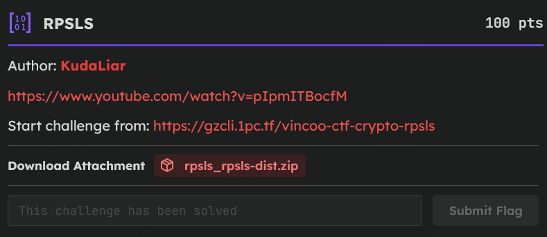

# [RPSLS]

- **CTF Name:** Vincoo CTF
- **Category:** Cryptography
- **Difficulty:** 100 pts
- **Hint:** [The Big Bang Theory - Rock Paper Scissors Lizard Spock](https://www.youtube.com/watch?v=pIpmITBocfM)
- **Challenge Author:** KudaLiar
- **Writeup Author:** Nakata Christian (n4ctbyte)
- **Date:** February 1, 2026
- **Source:** [Link to Challenge](https://tcp.1pc.tf/games/22/challenges#494-RPSLS)
- **File Source:** [Link to File](https://tcp.1pc.tf/assets/56ddc2920d85487da32de4272d3fe2a2b8cf01e7fdfdc60054fa9ad1a36afbf5/s/CfDJ8PBiKR2NsZFKsICZj0IlmeQzEUvCnK2MLU5NGWrM-q9Depn4cS5X9N3ZHDaY7FblTAqX2CkPZ98PsMHAzvTR2-AIwLXrd2wq-vBahdYwSFYwtTwX5lrlunHupPEYGy3vXV7roy_Ow5BXTs6hVGGrCcNPHRsc6JhNLBNJLBYQdLHH7o_eVT7zRF__Jn60M0-ZWASHnDrr7v4sK0604bhrvhA_i89WkXNkWqc10d9LZ9eu1lNW6iUZP7_uBJ8BbbF8HcdR2LNr6LVzml-jMpIDu4E/rpsls_rpsls-dist.zip)

---

## Challenge Description



## 1. Executive Summary

**Objective:**
To win a game of Rock-Paper-Scissors-Lizard-Spock against the server 200 times in a row to retrieve the flag. The server uses a Pseudo-Random Number Generator (PRNG) to determine its moves.

**Result:**
Successfully identified the original seed of the Mersenne Twister generator used by the server by performing a brute-force attack on the 24-bit seed space. With the discovered seed, all future server moves became predictable. The retrieved flag is: `VincooCTF{rOck-PaPEr-5c!5s0rS-1I2@RD-5pocK-1s-7h3-rE@L-rP5}`.

**Method:**
Analyze the `chall.py` source code to identify the PRNG algorithm and its vulnerability regarding low seed entropy. Developed a Python solver using the `pwntools` library to collect trial data, perform a local seed brute-force and automatically send winning moves.

---

## 2. Evidence Identification

This section provides details regarding the initial evidence file.

- **Filename:** `rpsls_rpsls-dist/chall.py`
- **Size:** `2.8 KB`
- **SHA-256:** `02241a11528ebca437d3b31936bb4981fb660b74720e17f85341d0ef61465979`

**Initial Check:**
Verifying file type using signature headers (Magic Bytes).

```bash
$ file chall.py
chall.py: Python script, ASCII text executable
```

---

## 3. Investigation Steps

### Step 1: Analyzing the PRNG Algorithm

The server utilizes a custom implementation of the Mersenne Twister. While the algorithm itself is robust, the critical vulnerability lies in the seeding method found in `chall.py`:

**Full Code:**

```python
#!/usr/bin/env python3
import sys
import os
import time

MASK = 0xFFFFFFFF
N = 32
M = 7
MATRIX_A = 0x9908B0DF
UPPER_MASK = 0x80000000
LOWER_MASK = 0x7FFFFFFF

state = [0] * N
index = N

def seed_mt(seed):
    global index
    state[0] = seed & MASK
    for i in range(1, N):
        state[i] = (1812433253 * (state[i-1] ^ (state[i-1] >> 30)) + i) & MASK
    index = N

def twist():
    global index
    for i in range(N):
        x = (state[i] & UPPER_MASK) | (state[(i+1) % N] & LOWER_MASK)
        xa = x >> 1
        if x & 1:
            xa ^= MATRIX_A
        state[i] = state[(i + M) % N] ^ xa
    index = 0

def extract_number():
    global index
    if index >= N:
        twist()
    y = state[index]
    index += 1
    y ^= y >> 11
    y ^= (y << 7) & 0x9D2C5680
    y ^= (y << 15) & 0xEFC60000
    y ^= y >> 18
    return y & MASK

def server_move():
    return extract_number() % 5

MOVES = ["Rock", "Paper", "Scissors", "Lizard", "Spock"]
WIN_MAP = {0: [2, 3], 1: [0, 4], 2: [1, 3], 3: [1, 4], 4: [0, 2]}

def beats(a, b):
    return b in WIN_MAP[a]

def send(msg):
    sys.stdout.write(msg)
    sys.stdout.flush()

def recv():
    try:
        line = sys.stdin.readline()
        if not line: return None
        return line.strip()
    except: return None

def get_flag():
    try:
        with open("flag.txt", "r") as f:
            return f.read().strip()
    except FileNotFoundError:
        return "VincooCTF{fakeflag}"

def main():
    send("Win the game, get the flag.\n")
    send("Here's free 100 trial games for you.\n\n")
    send("0: Rock, 1: Paper, 2: Scissors, 3: Lizard, 4: Spock\n\n")

    seed = int.from_bytes(os.urandom(3), "big")
    seed_mt(seed)

    free_rounds = 100
    required_wins = 200
    streak = 0
    round_no = 0

    flag = get_flag()

    while True:
        round_no += 1
        sm = server_move()

        if round_no <= free_rounds:
            send(f"[Trial {round_no}/100] ")
        else:
            send(f"[Streak {streak}/{required_wins}] ")

        send("Input (0-4): ")

        user_input = recv()
        if user_input is None: return

        try:
            cm = int(user_input)
        except:
            send("Invalid.\n")
            return

        if cm not in range(5):
            send("Invalid.\n")
            return

        send(f"Server played: {MOVES[sm]}\n")

        if cm == sm:
            send("Draw.\n")
            if round_no > free_rounds: streak = 0
        elif beats(cm, sm):
            send("Win!\n")
            if round_no > free_rounds: streak += 1
        else:
            send("Lose.\n")
            if round_no > free_rounds: streak = 0

        if streak >= required_wins:
            send("\nCongratz!\n")
            send(f"{flag}\n")
            return

if __name__ == "__main__":
    try:
        main()
    except KeyboardInterrupt:
        pass
```

**Vulnerable Code:**

```python
# Custom Mersenne Twister Parameters
MASK = 0xFFFFFFFF
N = 32
M = 7

# Low Entropy Seeding
seed = int.from_bytes(os.urandom(3), "big")
seed_mt(seed)
```

Using 3 bytes from `os.urandom` means there are only 2^24 or 16.777.216 possible seeds. This value is extremely low by modern security standards and can be brute-forced within minutes using a standard CPU.

### Step 2: Collecting Trial Data

The server provides 100 free trial rounds where winning is not required. I utilized this phase to collect the first 20 move results from the server as sample data to match against my local seed simulation.

### Step 3: Local Seed Brute-Force and Automation

A Python script was created to replicate the `seed_mt` and `extract_number` logic from the server. The script iterates through every possible number from 0 to 16.777.215:

1. Initialize the local generator with the candidate seed.
2. Generate the first 20 random numbers.
3. Compare them with the data captured from the server.
4. If they match perfectly, the server's seed is identified.

### Step 4: Automating the Win

Once the seed is identified locally, the generator is perfectly synchronized with the server's state. I developed a complete solver using `pwntools` to automate the data collection, the brute-force process, and the subsequent 200-round winning streak.

**Solver:**

```python
from pwn import *

# MT19937 Logic from chall.py
MASK, N, M = 0xFFFFFFFF, 32, 7
MATRIX_A, UPPER_MASK, LOWER_MASK = 0x9908B0DF, 0x80000000, 0x7FFFFFFF
state, index = [0] * N, N

def seed_mt(seed):
    global index
    state[0] = seed & MASK
    for i in range(1, N):
        state[i] = (1812433253 * (state[i-1] ^ (state[i-1] >> 30)) + i) & MASK
    index = N

def twist():
    global index
    for i in range(N):
        x = (state[i] & UPPER_MASK) | (state[(i+1) % N] & LOWER_MASK)
        xa = x >> 1
        if x & 1: xa ^= MATRIX_A
        state[i] = state[(i + M) % N] ^ xa
    index = 0

def extract_number():
    global index
    if index >= N: twist()
    y = state[index]; index += 1
    y ^= y >> 11
    y ^= (y << 7) & 0x9D2C5680
    y ^= (y << 15) & 0xEFC60000
    y ^= y >> 18
    return y & MASK

# Game Mappings
MOVES = ["Rock", "Paper", "Scissors", "Lizard", "Spock"]
# Counter moves to beat the server: 0->1 (P), 1->2 (S), 2->0 (R), 3->0 (R), 4->1 (P)
COUNTER = {0: 1, 1: 2, 2: 0, 3: 0, 4: 1}

io = remote('gzcli.1pc.tf', 37500)

# 1. Capture sample data from trials
captured = []
log.info("Collecting trial data...")
for i in range(20):
    io.recvuntil(b"Input (0-4): ")
    io.sendline(b"0")
    line = io.recvline().decode()
    move_name = line.split(": ")[1].strip()
    captured.append(MOVES.index(move_name))

# 2. Brute-force the 24-bit seed locally
log.info("Brute-forcing 24-bit seed...")
found_seed = None
for s in range(0x1000000):
    seed_mt(s)
    if all((extract_number() % 5) == m for m in captured):
        found_seed = s
        break

if found_seed is None:
    log.error("Seed not found!")
    exit()
log.success(f"Seed found: {found_seed}")

# 3. Skip remaining trials (21-100)
log.info("Clearing remaining trials...")
for _ in range(20, 100):
    extract_number()
    io.sendlineafter(b": ", b"0")

# 4. Automate 200 Streak Wins
log.info("Starting winning streak...")
for i in range(200):
    sm = extract_number() % 5
    io.sendlineafter(b": ", str(COUNTER[sm]).encode())

io.interactive()
```

---

## 4. Conclusion

This challenge demonstrates that even complex PRNG algorithms like the Mersenne Twister become ineffective if they are not initialized with sufficient entropy (seed strength). By limiting the seed to only 24 bits, the server makes its state prediction vulnerable through simple brute force techniques.
